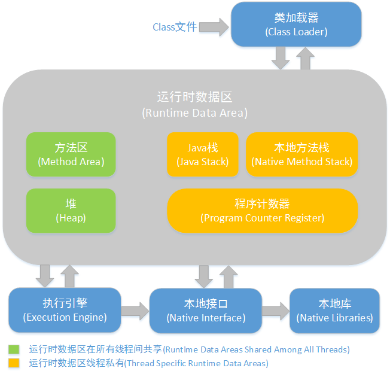

# Java 基础知识

## 面向对象

1. 面向对象三大特性 
    >封装,继承,多态

2. 面向对象五大基本原则 
    >单一职责原则SRP(Single Responsibility Principle) 
    >开放封闭原则OCP(Open－Close Principle) 
    >替换原则(the Liskov Substitution Principle LSP) 
    >依赖原则(the Dependency Inversion Principle DIP)  
    >接口分离原则(the Interface Segregation Principle ISP) 

3. Java支持的数据类型,自动拆装箱 

    基本类型 | 封装类
    ---- | ---
    byte | Byte
    int | Integer
    short | Short
    long | Long
    double | Double
    float | float
    boolean | Boolean
    char | Charter

4. heap 和 stack 有什么区别 
    >栈(stack)是一种线形集合，其添加和删除元素的操作应在同一段完成。栈按照后进先出的方式进行处理。 
    >堆(heap)是栈的一个组成元素。 

5. final, finally, finalize 的区别 
    >final 用于声明属性，方法和类，分别表示属性不可变，方法不可覆盖，类不可继承。 
    >finally 是异常处理语句结构的一部分，表示总是执行。 
    >finalize 是* Object* 类的一个方法，在垃圾收集器执行的时候会调用被回收对象的此方法，可以覆盖此方法提供垃圾收集时的其他资源回收，例如关闭文件等。

6. List, Set, Map 是否继承自 Collection 接口 
    >List,set 继承于 Collection。 
    >Map 没有继承于 Collection，其相对是独立的。 
    >属于 Collection 类型的对象， 可以通过构造函数将一个集合构造成另外一个集合。

7. 什么是类的反射机制 
    >通过类(Class 对象)，可以得出当前类的 fields、 method、 construtor、 interface、superClass、 modified 等，同时可以通过类实例化一个实例、设置属性、唤醒方法。 Spring 中一切都是返射、 struts、 hibernate 都是通过类的反射进行开发的

## 设计模式

## JVM

1. JVM类的加载 
    >JVM中类的装载是由ClassLoader和它的子类来实现的，Java ClassLoader是一个重要的Java运行时系统组件，它负责在运行时查找和装入类文件的类。

     

2. 类加载器 

     

3. JVM内存结构

     

4. GC对象存活判断
    >引用计数：每个对象有一个引用计数属性，新增一个引用时计数加1，引用释放时计数减1，计数为0时可以回收。此方法简单，无法解决对象相互循环引用的问题。 
    >可达性分析（Reachability Analysis）：从GC Roots开始向下搜索，搜索所走过的路径称为引用链。当一个对象到GC Roots没有任何引用链相连时，则证明此对象是不可用的，不可达对象。 

## 多线程

1.  进程，线程

## 网络

1. BIO,NIO,AIO 
    >同步阻塞的BIO、同步非阻塞的NIO、异步非阻塞的AIO

2. TCP3次握手,4次挥手 

     

3. 7层网络模型 
    >物理层，数据链路层，网络层，传输层，会话层，表示层，应用层

     

