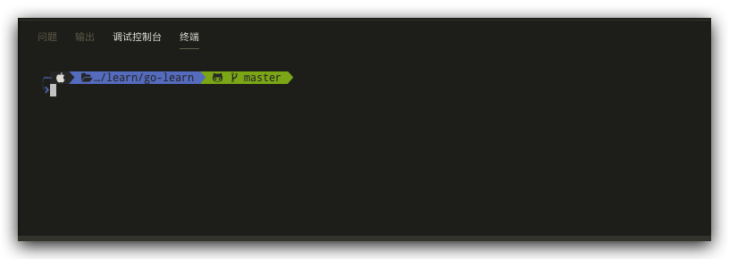

# VSCode 配置终端

## Mac配置终端

1.  VSCode增加终端设置

    Code -> 首选项 -> 设置 -> 搜索“终端” -> 在setting.json编辑

    ```内容
    # 新增或修改
    "terminal.integrated.shell.osx": "/bin/zsh",
    "terminal.integrated.fontFamily": "DroidSansMono Nerd Font",
    ```

    <br>