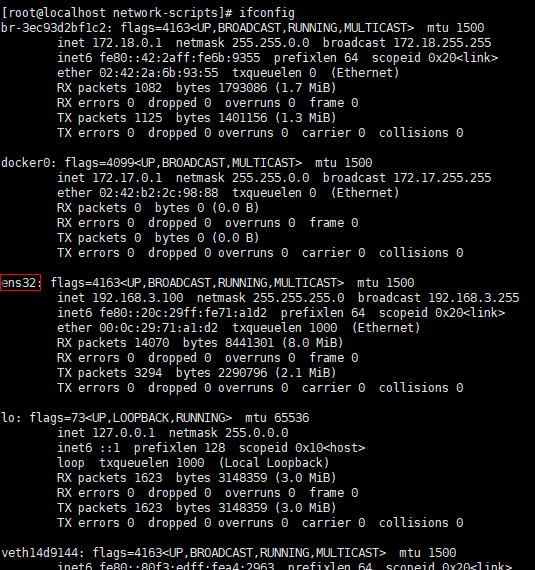
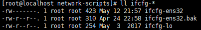
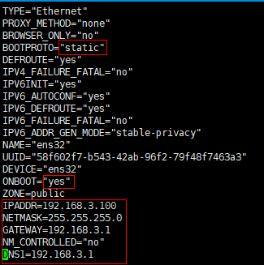

# CentOS7 设置静态 IP

## 系统设置

1.  使用root用户登录<br>

2.  进入到网卡配置目录<br>

    ```命令
    > cd /etc/sysconfig/network-scripts/
    ```

3.  查看网卡信息并获取到网卡的名称<br>

    ```命令
    > ifconfig
    ```

    <br>

4.  修改配置文件ifcfg-ens32<br>

    ```命令
    > ll ifcfg-*
    > vim ifcfg-ens32
    ```

    ```内容
    TYPE="Ethernet"
    PROXY_METHOD="none"
    BROWSER_ONLY="no"
    BOOTPROTO="static"
    DEFROUTE="yes"
    IPV4_FAILURE_FATAL="no"
    IPV6INIT="yes"
    IPV6_AUTOCONF="yes"
    IPV6_DEFROUTE="yes"
    IPV6_FAILURE_FATAL="no"
    IPV6_ADDR_GEN_MODE="stable-privacy"
    NAME="ens32"
    UUID="58f602f7-b543-42ab-96f2-79f48f7463a3"
    DEVICE="ens32"
    ONBOOT="yes"
    ZONE=public
    IPADDR=192.168.3.100
    NETMASK=255.255.255.0
    GATEWAY=192.168.3.1
    NM_CONTROLLED="no"
    DNS1=192.168.3.1
    ```

    <br>
    <br>

5.  重启网卡

    ```命令
    > systemctl restart network
    ```
