# 安装 CentOS7 操作系统

## 安装操作系统

1.  开机 -> 使用键盘的上下箭头按钮，选择“Install CentOS 7”选项 -> 按下回车键，开始安装 CentOS 7<br>
    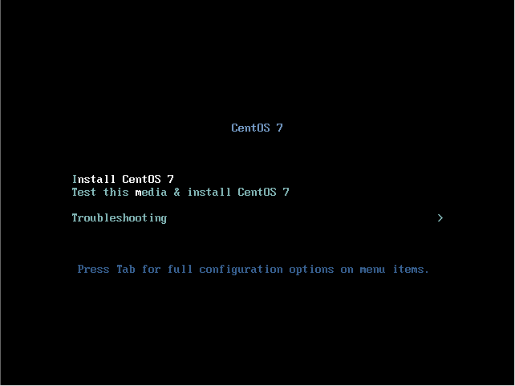<br>
2.  语言选择：English English(United States) -> 选择时区：Asia/Shanghai -> 软件选择：GNOME Desktop -> 安装位置：已选择自动分区 -> 网络和主机名：选择默认 -> 开始安装<br>
    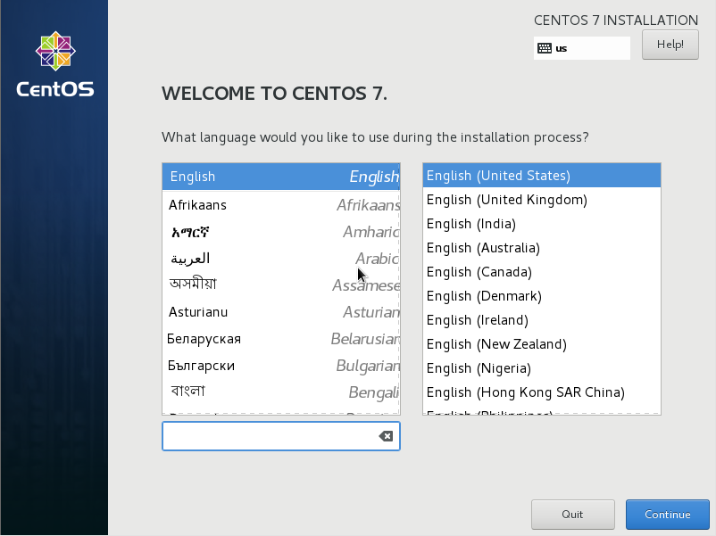<br>
    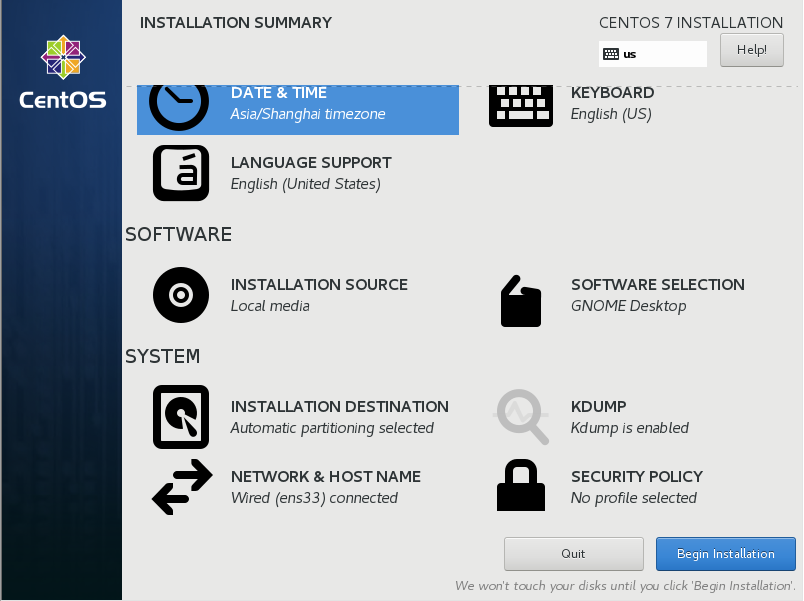<br>
3.  设置root密码 -> 创建新用户 -> 重启<br>
    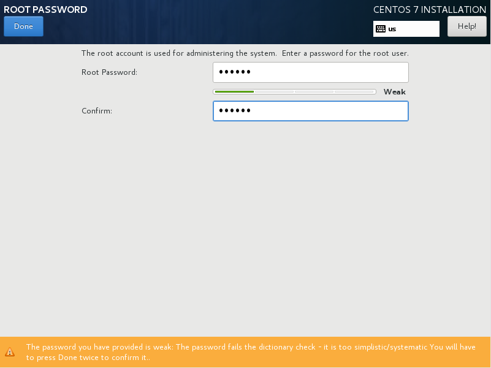<br>
    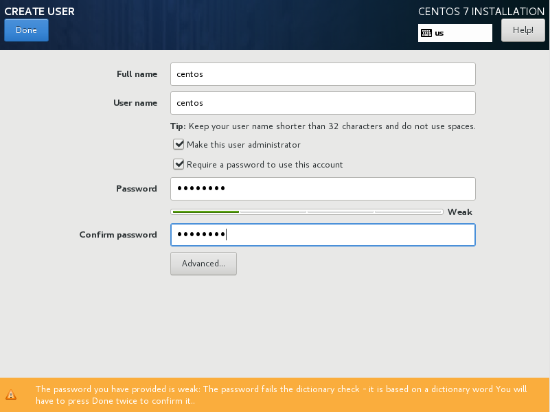<br>
    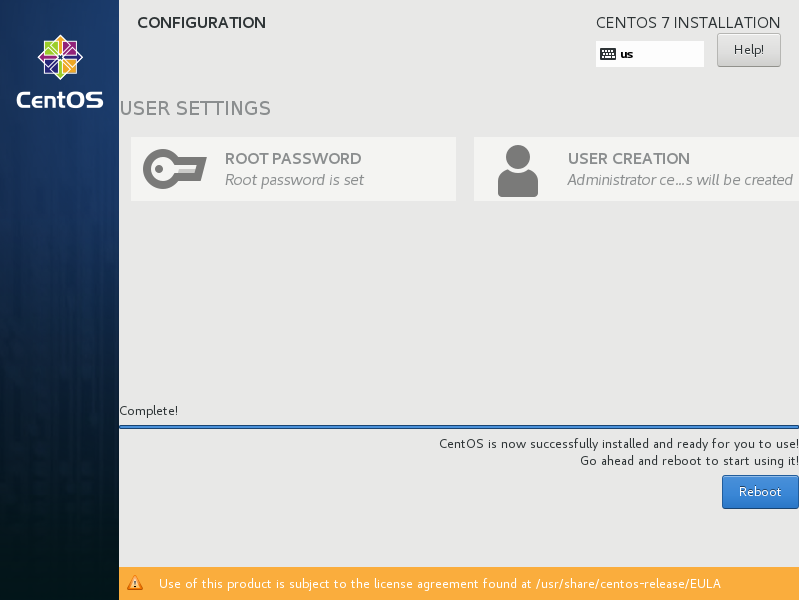<br>

    > root密码：123456
    > 新用户：centos 密码：1qaz2wsx

4.  确认授权许可 -> 完成配置<br>
    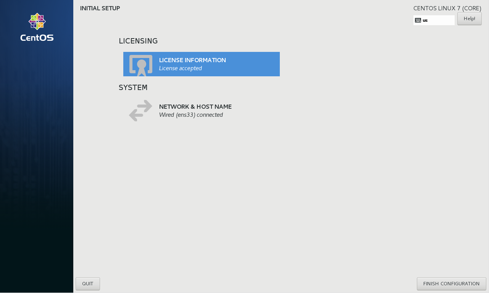<br>
5.  选择登录用户 -> 输入密码 -> 登录<br>
    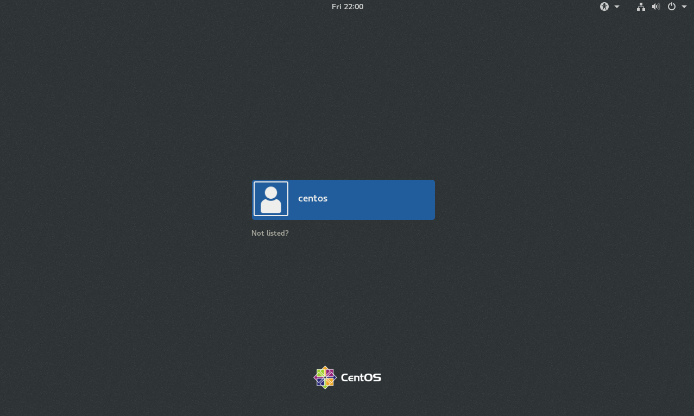<br>
    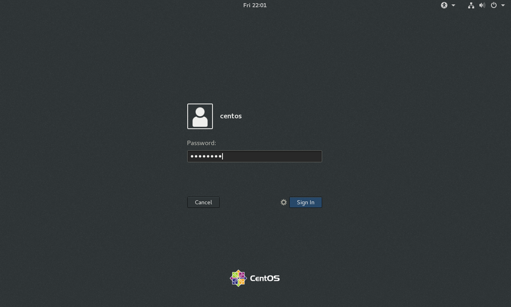<br>
6.  选择语言(English) -> 选择键盘布局(English(US)) -> 开启本地服务 -> 网络账号绑定(跳过) -> 开始使用<br>
    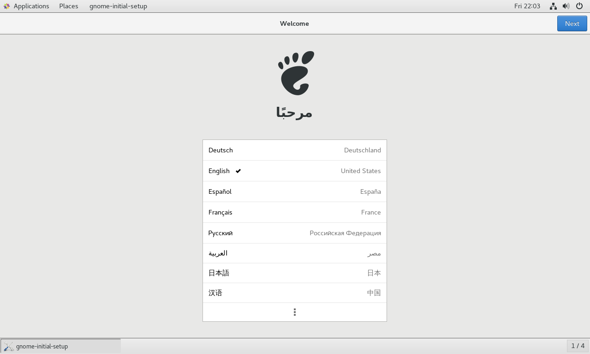<br>
    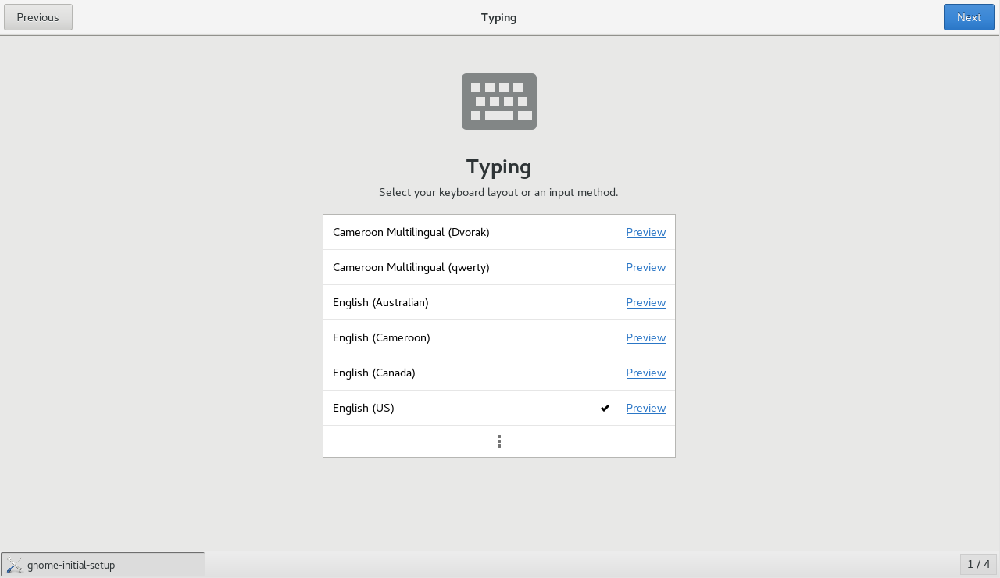<br>
    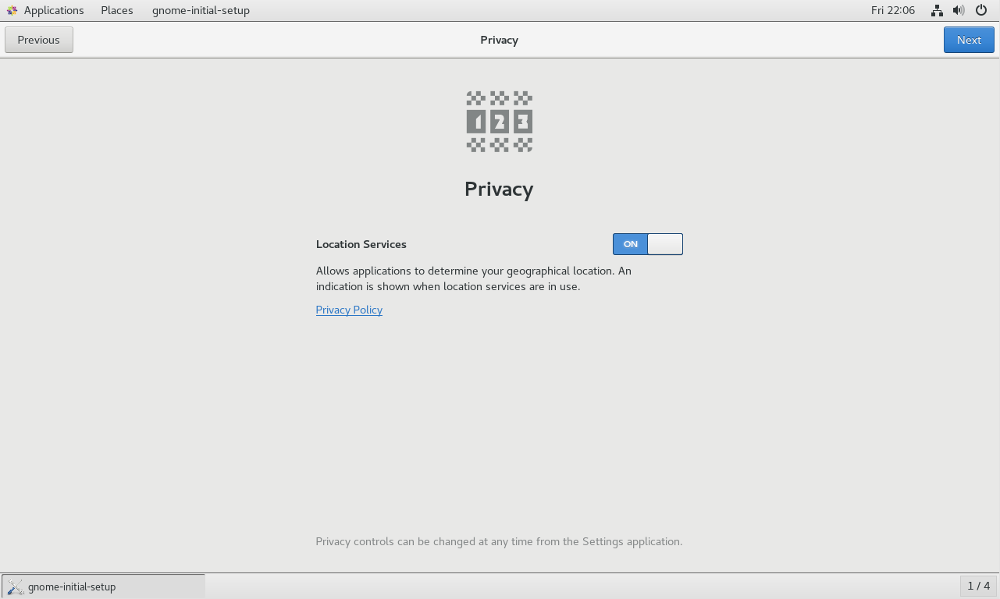<br>
7.  软件更新<br>

    ```命令
    > su - root
    > yum update
    ```
