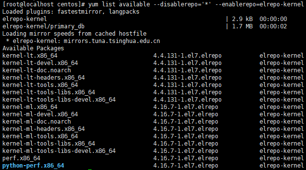
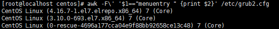

# CentOS7 升级内核

## 升级过程

1.  查看最新的操作方式<br>

    > [查看 ELRepo 操作地址][elrepo操作地址]

2.  使用root用户登录<br>

3.  导入公钥<br>

    ```命令
    > rpm --import https://www.elrepo.org/RPM-GPG-KEY-elrepo.org
    ```

4.  安装ELRepo<br>

    ```命令
    > rpm -Uvh http://www.elrepo.org/elrepo-release-7.0-3.el7.elrepo.noarch.rpm
    ```

5.  查看最新内核版本<br>

    ```命令
    > yum list available --disablerepo='*' --enablerepo=elrepo-kernel
    ```

    <br>

6.  安装最新版内核<br>

    ```命令
    > yum -y --enablerepo=elrepo-kernel install kernel-ml.x86_64 kernel-ml-devel.x86_64 kernel-ml-headers.x86_64
    ```

7.  查看内核启动顺序<br>

    ```命令
    > awk -F\' '$1=="menuentry " {print $2}' /etc/grub2.cfg
    ```

    <br>

8.  修改内核默认启动<br>

    ```命令
    > vim /etc/default/grub
    ```

    <br>

9.  重建内核配置<br>

    ```命令
    > grub2-mkconfig -o /boot/grub2/grub.cfg
    ```

    <br>

10. 重启<br>

    ```命令
    > reboot
    ```

11. 查看内核是否正确<br>

    ```命令
    > uname -r
    ```

    <br>

12. 查询多余内核<br>

    ```命令
    > rpm -qa | grep kernel
    ```

    <br>

13. 删除多余内核<br>

    ```命令
    > rpm -e kernel-3.10.0-693.el7.x86_64
    > rpm -e kernel-tools-3.10.0-693.el7.x86_64
    > rpm -e kernel-tools-libs-3.10.0-693.el7.x86_64
    > rpm -qa | grep kernel
    ```

    <br>

14. 安装内核工具<br>

    ```命令
    > yum -y --enablerepo=elrepo-kernel install kernel-ml-tools.x86_64 kernel-ml-tools-libs.x86_64 kernel-ml-tools-libs-devel.x86_64
    > rpm -qa | grep kernel
    ```

    <br>

15. 验证内核启动顺序<br>

    ```命令
    > awk -F\' '$1=="menuentry " {print $2}' /etc/grub2.cfg
    ```

    <br>

[elrepo操作地址]: http://elrepo.org/tiki/tiki-index.php
