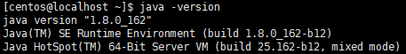
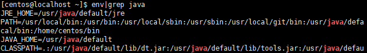

# CentOS7 安装 Jdk1.8

## 软件安装

1.  软件下载(Java SE Development Kit 8u162)<br>

    > [下载 jdk-8u162-linux-x64.rpm 地址][jdk下载地址]

2.  查询默认JDK<br>

    ```命令
    > sudo rpm -qa|grep java
    ```

3.  卸载默认JDK<br>

    ```命令
    > sudo rpm -e --nodeps {应用名称}
    ```

4.  创建software文件夹<br>

    ```命令
    > sudo mkdir -p /usr/software
    ```

5.  FTP上传jdk-8u162-linux-x64.rpm<br>

6.  安装JDK<br>

    ```命令
    > sudo rpm -ivh /usr/software/jdk-8u162-linux-x64.rpm
    ```

    > ![info][info] 应用默认安装到/usr/java

7.  验证安装结果<br>
    
8.  设置环境变量<br>

    ```命令
    > sudo vim /etc/profile.d/jdk.sh
    ```

    ```内容
    JAVA_HOME=/usr/java/default
    JRE_HOME=$JAVA_HOME/jre
    PATH=$PATH:$JAVA_HOME/bin
    CLASSPATH=.:$JAVA_HOME/lib/dt.jar:$JAVA_HOME/lib/tools.jar:$JRE_HOME/lib

    export JAVA_HOME JRE_HOME PATH CLASSPATH
    ```

9.  刷新环境变量<br>

    ```命令
    > source /etc/profile
    ```

10. 检查环境变量是否生效<br>

    ```命令
    > env|grep java
    ```

    

[jdk下载地址]: http://www.oracle.com/technetwork/java/javase/downloads/jdk8-downloads-2133151.html

[info]: /images/info.png
