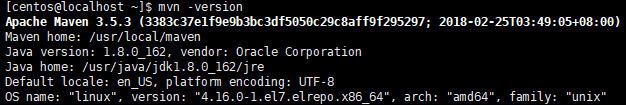
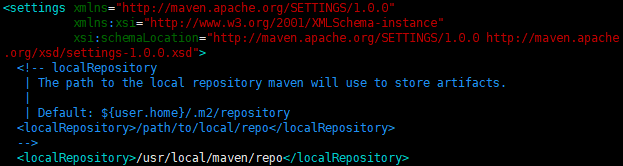

# CentOS7 安装 Maven3

## 软件安装

1.  软件下载(Apache Maven 3.5.3)<br>

    > [下载 apache-maven-3.5.3-bin.tar.gz 地址][maven下载地址]

2.  创建software文件夹<br>

    ```命令
    > sudo mkdir -p /usr/software
    ```

3.  FTP上传apache-maven-3.5.3-bin.tar.gz<br>

4.  解压maven<br>

    ```命令
    > sudo tar -zxvf /usr/software/apache-maven-3.5.3-bin.tar.gz
    ```

5.  创建maven文件夹<br>

    ```命令
    > sudo mkdir /usr/local/maven
    ```

6.  移动解压文件到maven文件夹<br>

    ```命令
    > sudo mv apache-maven-3.5.3/* /usr/local/maven/
    > sudo rm -rf apache-maven-3.5.3/
    ```

7.  设置环境变量<br>

    ```命令
    > sudo vim /etc/profile.d/maven.sh
    ```

    ```内容
    MAVEN_HOME=/usr/local/maven
    PATH=$PATH:$MAVEN_HOME/bin

    export MAVEN_HOME PATH
    ```

8.  刷新环境变量<br>

    ```命令
    > source /etc/profile
    ```

9.  检查环境变量是否生效<br>

    ```命令
    > mvn -version
    ```

    

10. 修改maven的repository本地存放路径并保存<br>

    ```命令
    > sudo vim /usr/local/maven/conf/settings.xml
    ```

    ```内容
    <localRepository>/usr/local/maven/repo</localRepository>
    ```

    

[maven下载地址]: https://maven.apache.org/download.cgi
