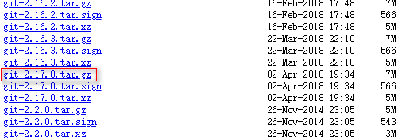
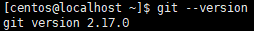

# CentOS7 安装 Git2

## 软件安装

1.  软件下载(git2.17.0)<br>

    > [下载 git2.17.0 地址][git下载地址]

    <br>

2.  创建software文件夹<br>

    ```命令
    > sudo mkdir -p /usr/software
    ```

3.  FTP上传git-2.17.0.tar.gz<br>

4.  解压git<br>

    ```命令
    > sudo tar -zxvf /usr/software/git-2.17.0.tar.gz
    ```

5.  创建git文件夹<br>

    ```命令
    > sudo mkdir /usr/local/git
    ```

6.  移动解压文件到git文件夹<br>

    ```命令
    > sudo mv git-2.17.0/* /usr/local/git/
    > sudo rm -rf git-2.17.0/
    ```

7.  安装依赖软件<br>

    ```命令
    > sudo yum -y install curl-devel expat-devel gettext-devel openssl-devel zlib-devel
    > sudo yum -y install gcc perl-ExtUtils-MakeMaker
    ```

8.  卸载默认的git<br>

    ```命令
    > sudo yum -y remove git
    ```

9.  编译软件<br>

    ```命令
    > cd /usr/local/git/
    > sudo make prefix=/usr/local/git all
    > sudo make prefix=/usr/local/git install
    ```

10. 设置环境变量<br>

    ```命令
    > sudo vim /etc/profile.d/git.sh
    ```

    ```内容
    GIT_HOME=/usr/local/git
    PATH=$PATH:$GIT_HOME/bin

    export GIT_HOME PATH
    ```

11. 刷新环境变量<br>

    ```命令
    > source /etc/profile
    ```

12. 检查环境变量是否生效<br>

    ```命令
    > git --version
    ```

    <br>

[git下载地址]: https://mirrors.edge.kernel.org/pub/software/scm/git/
