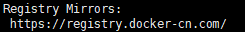
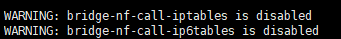

# CentOS7 安装 Docker

## 软件安装

1.  删除原有Docker安装程序<br>

    ```命令
    > sudo yum remove docker \
                 docker-client \
                 docker-client-latest \
                 docker-common \
                 docker-latest \
                 docker-latest-logrotate \
                 docker-logrotate \
                 docker-selinux \
                 docker-engine-selinux \
                 docker-engine
    ```

2.  安装依赖工具包<br>

    ```命令
    > sudo yum install -y yum-utils device-mapper-persistent-data lvm2
    ```

3.  添加Docker的yum源配置<br>

    ```命令
    > sudo yum-config-manager --add-repo https://download.docker.com/linux/centos/docker-ce.repo
    ```

4.  设置Docker的安装版本<br>

    ```命令
    > sudo yum-config-manager --enable docker-ce-edge
    ```

    > ![info][info]
    > 最新版本的Docker CE，用docker-ce-edge
    > 测试版本的Docker CE，用docker-ce-test
    > 默认版本为docker-ce-stable

5.  安装Docker<br>

    ```命令
    > sudo yum install docker-ce
    ```

6.  设置Docker自动启动<br>

    ```命令
    > sudo systemctl enable docker
    ```

7.  启动Docker<br>

    ```命令
    > sudo systemctl start docker
    ```

8.  建立docker用户组<br>

    ```命令
    > sudo groupadd docker
    > sudo usermod -aG docker $USER
    ```

    > ![info][info] 只有root用户和docker组的用户才可以访问Docker引擎的Unix socket

9.  重新登录后，验证是否正确安装<br>

    ```命令
    > docker info
    ```

10. 设置镜像加速<br>
    a. 添加文件daemon.json<br>

    ```命令
    > sudo vim /etc/docker/daemon.json
    ```

    ```内容
    {
      "registry-mirrors": [
        "https://registry.docker-cn.com"
      ]
    }
    ```

    b. 重启Docker<br>

    ```命令
    > sudo systemctl daemon-reload
    > sudo systemctl restart docker
    ```

    c. 验证是否增加成功<br>

    ```命令
    > docker info
    ```

    <br>

11. 添加内核参数<br>

    > ![info][info] 执行docker info出现告警时进行操作
    > <br>

    a. 修改文件sysctl.conf<br>

    ```命令
    > sudo tee -a /etc/sysctl.conf <<-EOF
    ```

    ```内容
    net.bridge.bridge-nf-call-ip6tables = 1
    net.bridge.bridge-nf-call-iptables = 1
    EOF
    ```

    b. 重新加载sysctl.conf<br>

    ```命令
    > sudo sysctl -p
    ```

    c. 验证是否增加成功<br>

    ```命令
    > docker info
    ```

[info]: /images/info.png
