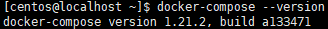

# CentOS7 安装 Docker Compose

## 软件安装

1.  进入docker-compose的版本网站<br>

    > [安装 docker-compose 地址][docker-compose地址]

2.  下载docker-compose到本地<br>

    ```命令
    > curl -L https://github.com/docker/compose/releases/download/1.21.2/docker-compose-`uname -s`-`uname -m` -o /usr/local/bin/docker-compose
    ```

3.  docker-compose执行目录授权<br>

    ```命令
    > chmod +x /usr/local/bin/docker-compose
    ```

4.  验证安装docker-compose结果<br>

    ```命令
    > docker-compose --version
    ```

    <br>

[docker-compose地址]: https://github.com/docker/compose/releases
