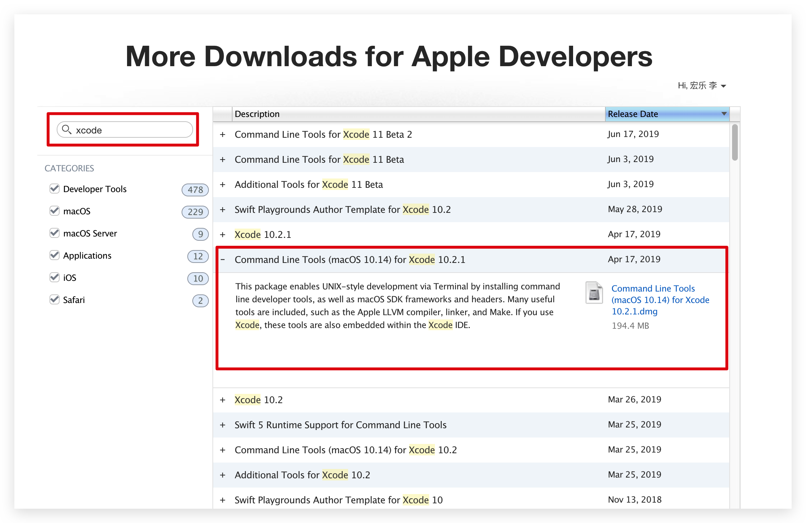

# 安装 Homebrew

## 安装软件

1.  Homebrew概述

    Homebrew是一款Mac OS上的软件包管理工具，通过它可以很方便的安装/卸载软件工具等，类似于Linux下的apt-get，node的npm等包管理工具。<br>

    Homebrew将工具安装在自己创建的/usr/local/Cellar目录下，并在/usr/local/bin建立这些工具的符号链接。<br>

    > [Homebrew官网][中文官网]

2.  安装brew

    a.  安装xcode

    > 下载地址：https://developer.apple.com/download/more/

    <br>

    b.  打开终端，执行下面的命令。

    ```ruby
    /usr/bin/ruby -e "$(curl -fsSL https://raw.githubusercontent.com/Homebrew/install/master/install)"
    ```

3.  使用命令
    a.  通用类

    | 命令                                     | 说明                   |
    | ---------------------------------------- | ---------------------- |
    | brew search [TEXT\|/REGEX/]              | 搜索软件               |
    | brew (info\|home\|options)  [FORMULA...] | 查询软件信息           |
    | brew install FORMULA...                  | 安装软件               |
    | brew update                              | 更新brew和所有软件包   |
    | brew upgrade [FORMULA...]                | 更新软件包             |
    | brew uninstall FORMULA...                | 卸载软件包             |
    | brew list [FORMULA...]                   | 罗列所有已安装的软件包 |
    | brew outdated                            | 查看哪些软件包需要更新 |
    | brew deps FORMULA                        | 显示包依赖             |

    b.  帮助类

    | 命令                | 说明                                         |
    | ------------------- | -------------------------------------------- |
    | man brew            | 查询brew命令的使用手册                       |
    | brew help [COMMAND] | 查询brew子命令的使用帮助，如brew help search |

    c.  排查类

    | 命令                     | 说明                                    |
    | ------------------------ | --------------------------------------- |
    | brew config              | 查看brew的全局配置                      |
    | brew doctor              | 检查系统的潜在问题                      |
    | brew install -vd FORMULA | 安装软件包打印详细信息，并开启debug功能 |

    d.  开发者类

    | 命令                           | 说明           |
    | ------------------------------ | -------------- |
    | brew create [URL [--no-fetch]] | 创建软件包     |
    | brew edit [FORMULA...]         | 编辑软件包源码 |

    > 更多命令使用查看文档：https://docs.brew.sh/Formula-Cookbook.html.

4.  安装brew

    a.  打开终端，执行下面的命令。

    ```ruby
    /usr/bin/ruby -e "$(curl -fsSL https://raw.githubusercontent.com/Homebrew/install/master/uninstall)"
    ```

5.  推荐软件包
    - coreutils
    - openssl
    - xz
    - wget
    - lrzsz

[中文官网]: https://brew.sh/index_zh-cn