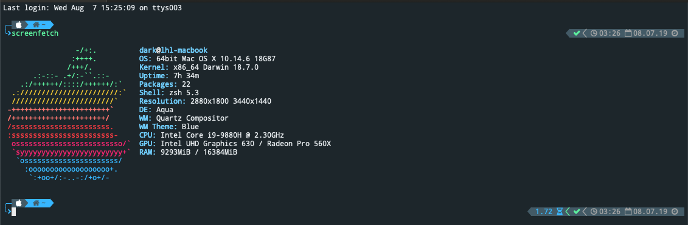

# MacOS 安装 zsh

## 安装 zsh

1.  直接用Homebrew安装zsh

    ```命令
    brew install zsh
    ```

2.  替换默认脚本命令

    ```命令
    cat /etc/shells
    ```

    ```内容
    # 不存在则添加
    /bin/zsh
    ```

3.  使zsh生效

    ```命令
    chsh -s /bin/zsh
    ```

## 安装 oh-my-zsh

1.  下载oh-my-zsh

    ```命令
    sh -c "$(curl -fsSL https://raw.github.com/robbyrussell/oh-my-zsh/master/tools/install.sh)"
    ```

## 安装 iTerm2

1.  安装iTerm2

    下载地址：https://www.iterm2.com/

2.  下载iTerm2主题和字体

    ```命令
    # 下载
    mkdir tmp
    cd tmp
    git clone https://github.com/MartinSeeler/iterm2-material-design.git
    ```

    双击material-design-colors.itermcolors进行安装

    ```命令
    # 删除临时文件
    cd ..
    rm -rf tmp/
    ```
    ```命令
    # 字体解决乱码问题
    cd ~/Library/Fonts && curl -fLo "Droid Sans Mono for Powerline Nerd Font Complete.otf" https://github.com/ryanoasis/nerd-fonts/raw/master/patched-fonts/DroidSansMono/complete/Droid%20Sans%20Mono%20Nerd%20Font%20Complete.otf
    ```

3.  安装主题

    a.  打开iTerm2，打开设置->Profiles->Colors->Color Presets->material-design-colors->更改iTerm2终端字体->搜索nerd选择->command+W
    b.  安装powerlevel9k<br>
    
    ```命令
    git clone https://github.com/bhilburn/powerlevel9k.git ~/.oh-my-zsh/custom/themes/powerlevel9k
    ```

    c.  修改配置文件
        
    ```命令
    vim ~/.zshrc
    ```
        
    ```内容
    POWERLEVEL9K_MODE="nerdfont-complete"

    ZSH_THEME="powerlevel9k/powerlevel9k"

    # ================= powerlevel9k Settings =================
    # Please only use this battery segment if you have material icons in your nerd font (or font)
    # Otherwise, use the font awesome one in "User Segments"

    prompt_context() {
      if [[ "$USER" != "$DEFAULT_USER" || -n "$SSH_CLIENT" ]]; then
        prompt_segment black default "%(!.%.)"
      fi
    }
    DEFAULT_USER=dark

    POWERLEVEL9K_PROMPT_ON_NEWLINE=true
    POWERLEVEL9K_PROMPT_ADD_NEWLINE=true
    POWERLEVEL9K_RPROMPT_ON_NEWLINE=true
    POWERLEVEL9K_SHORTEN_DIR_LENGTH=2
    POWERLEVEL9K_SHORTEN_STRATEGY="truncate_beginning"
    POWERLEVEL9K_RVM_BACKGROUND="black"
    POWERLEVEL9K_RVM_FOREGROUND="249"
    POWERLEVEL9K_RVM_VISUAL_IDENTIFIER_COLOR="red"
    POWERLEVEL9K_TIME_BACKGROUND="black"
    POWERLEVEL9K_TIME_FOREGROUND="249"
    POWERLEVEL9K_TIME_FORMAT="\UF43A %D{%I:%M \UF133 %m.%d.%y}"
    POWERLEVEL9K_RVM_BACKGROUND="black"
    POWERLEVEL9K_RVM_FOREGROUND="249"
    POWERLEVEL9K_RVM_VISUAL_IDENTIFIER_COLOR="red"
    POWERLEVEL9K_STATUS_VERBOSE=false
    POWERLEVEL9K_VCS_CLEAN_FOREGROUND='black'
    POWERLEVEL9K_VCS_CLEAN_BACKGROUND='green'
    POWERLEVEL9K_VCS_UNTRACKED_FOREGROUND='black'
    POWERLEVEL9K_VCS_UNTRACKED_BACKGROUND='yellow'
    POWERLEVEL9K_VCS_MODIFIED_FOREGROUND='white'
    POWERLEVEL9K_VCS_MODIFIED_BACKGROUND='black'
    POWERLEVEL9K_COMMAND_EXECUTION_TIME_BACKGROUND='black'
    POWERLEVEL9K_COMMAND_EXECUTION_TIME_FOREGROUND='blue'
    POWERLEVEL9K_FOLDER_ICON=''
    POWERLEVEL9K_STATUS_OK_IN_NON_VERBOSE=true
    POWERLEVEL9K_STATUS_VERBOSE=false
    POWERLEVEL9K_COMMAND_EXECUTION_TIME_THRESHOLD=0
    POWERLEVEL9K_VCS_UNTRACKED_ICON='\u25CF'
    POWERLEVEL9K_VCS_UNSTAGED_ICON='\u00b1'
    POWERLEVEL9K_VCS_INCOMING_CHANGES_ICON='\u2193'
    POWERLEVEL9K_VCS_OUTGOING_CHANGES_ICON='\u2191'
    POWERLEVEL9K_VCS_COMMIT_ICON="\uf417"
    POWERLEVEL9K_MULTILINE_FIRST_PROMPT_PREFIX="%F{blue}\u256D\u2500%f"
    POWERLEVEL9K_MULTILINE_LAST_PROMPT_PREFIX="%F{blue}\u2570\uf460%f"
    POWERLEVEL9K_LEFT_PROMPT_ELEMENTS=(context os_icon custom_internet_signal custom_battery_status_joined ssh root_indicator dir dir_writable vcs)
    POWERLEVEL9K_RIGHT_PROMPT_ELEMENTS=(command_execution_time status time)
    HIST_STAMPS="mm/dd/yyyy"
    DISABLE_UPDATE_PROMPT=true
    ```
    
    d.  安装插件

    -   安装 autosuggestions（自动提示）
            
        ```命令
        git clone https://github.com/zsh-users/zsh-autosuggestions $ZSH_CUSTOM/plugins/zsh-autosuggestions
        ```

    -   安装 syntax-highlighting（动态高亮）
            
        ```命令
        git clone https://github.com/zsh-users/zsh-syntax-highlighting.git ${ZSH_CUSTOM:-~/.oh-my-zsh/custom}/plugins/zsh-syntax-highlighting
        ```

    -   修改配置

        ```命令
        vim ~/.zshrc
        ```
    
        ```内容
        # 注意：zsh-syntax-highlighting 必须放在最后面（官方推荐）
        plugins=(
        git
        zsh-autosuggestions
        zsh-syntax-highlighting
        )
        ```
    
    e.  补充环境配置

    ```命令
    vim ~/.zshrc
    ```

    ```内容
    # 在配置末增加
    source $HOME/.bash_profile
    ```

    ```命令
    brew install screenfetch
    brew install coreutils
    ```

    ```命令
    vim ~/.bash_profile
    ```

    ```内容
    # 在配置末增加
    export PATH="/usr/local/opt/coreutils/libexec/gnubin:$PATH"
    alias readlink=greadlink
    ```
    
    <br>    