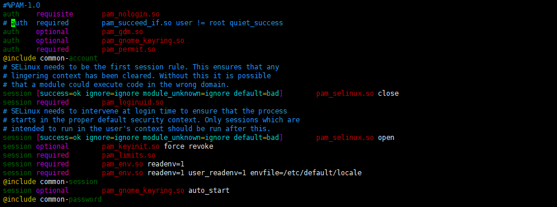
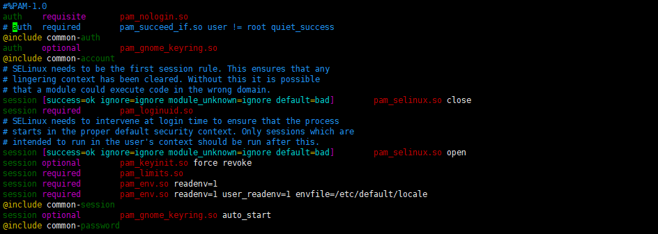
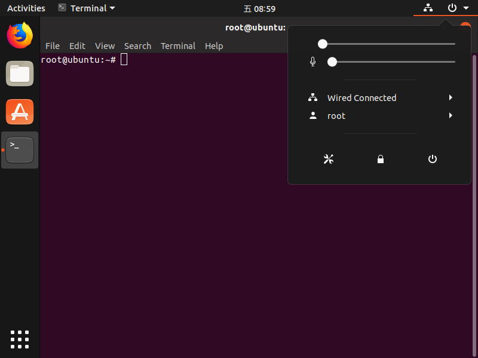

# Ubuntu18 启用 root 用户

## 系统设置

1. 获得临时的root权限，打开终端输入以下命令，之后直接输入当前账户的密码，就可以获得临时的root权限<br>

    ```命令
    > sudo -s
    ```

2. 创建root账户：根据提示输入密码（此时输入的密码是以后登录root账户时的密码）<br>

    ```命令
    > passwd root
    ```

3. 修改配置文件<br>

    ```命令
    > vim /usr/share/lightdm/lightdm.conf.d/50-ubuntu.conf
    ```

    ```内容
    greeter-show-manual-login=true 
    all-guest=false 
    ```

    ```命令
    > cd /etc/pam.d
    > vim gdm-autologin
    > vim gdm-password 
    ```

    ```内容
    注释掉"auth required pam_succeed_if.so user != root quiet_success"
    ```

    <br>
    <br>

    ```命令
    > vim /root/.profile
    ```

    ```内容
    修改"mesg n || true"为"tty -s&&mesg n || true"
    ```

    <br>

4. 重启验证<br>

    <br>