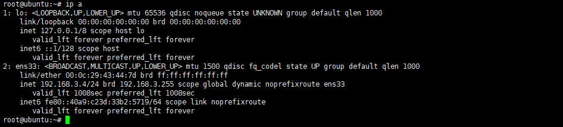
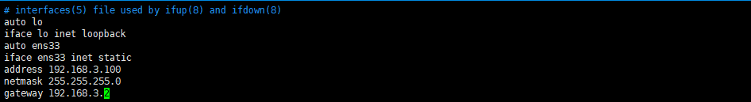
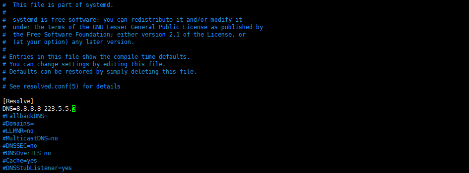
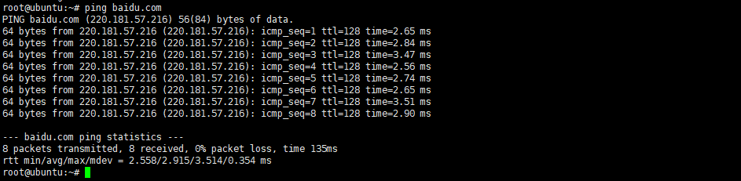
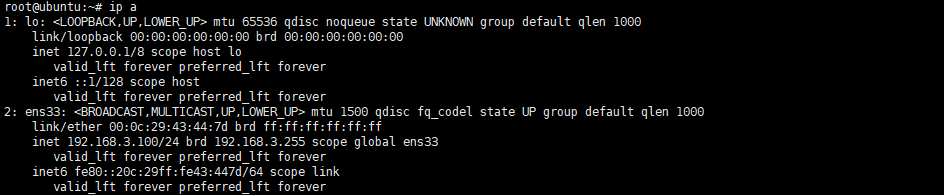

# Ubuntu18 设置静态 IP

## 系统设置

1. 获得临时的root权限，打开终端输入以下命令，之后直接输入当前账户的密码，就可以获得临时的root权限<br>

    ```命令
    > sudo -s
    ```

2. 查看网卡编号<br>

    ```命令
    > ip a
    ```

    <br>

3. 编辑网络文件<br>

    ```命令
    > vim /etc/network/interfaces
    ```

    ```内容
    auto ens33
    iface ens33 inet static
    address 192.168.3.100
    netmask 255.255.255.0
    gateway 192.168.3.2
    ```

    <br>

    ```命令
    > vim /etc/systemd/resolved.conf
    ```

    ```内容
    DNS=8.8.8.8 223.5.5.5
    ```
    
    <br>

4. 重启网络并验证<br>

    ```命令
    > /etc/init.d/networking restart
    > ping baidu.com
    > ip a
    ```

    <br>
    <br>
    <br>