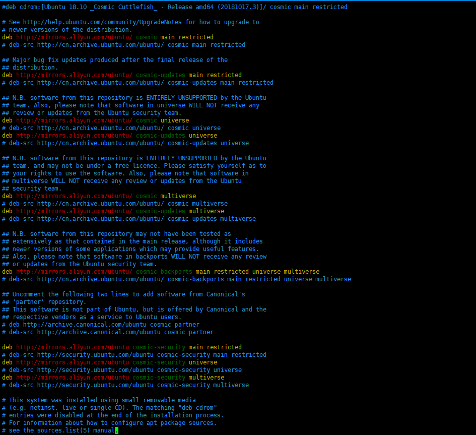

# Ubuntu18 替换更新源地址

## 系统设置

1. 获得临时的root权限，打开终端输入以下命令，之后直接输入当前账户的密码，就可以获得临时的root权限<br>

    ```命令
    > sudo -s
    ```

2. 备份历史源列表文件<br>

    ```命令
    > cp /etc/apt/sources.list /etc/apt/sources.list.old
    ```

3. 修改源列表文件指向阿里云地址<br>

    ```命令
    > vim /etc/apt/sources.list
    ```

    ```内容
    替换所有地址为"mirrors.aliyun.com"
    ```

    <br>

4. 验证更新<br>

    ```命令
    > apt-get update
    ```