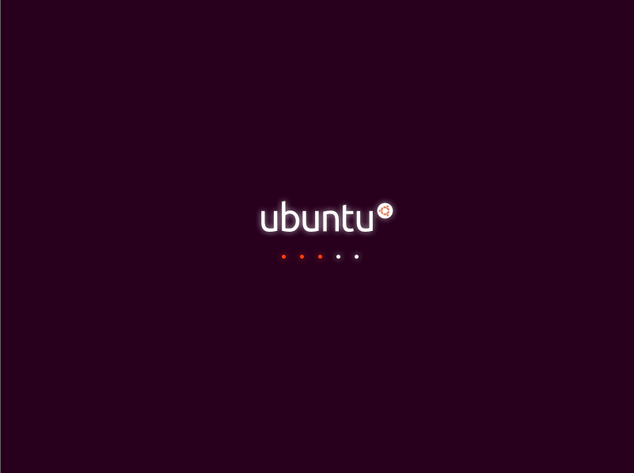
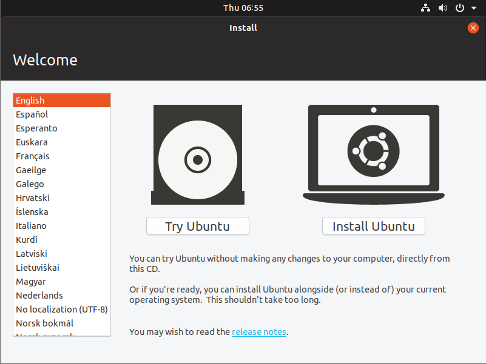
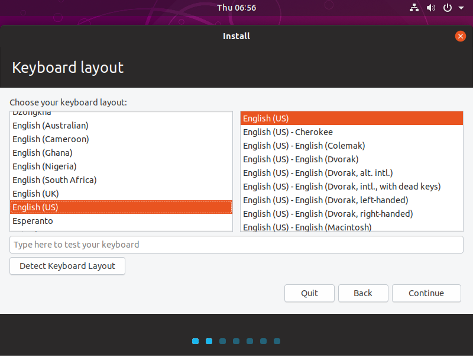
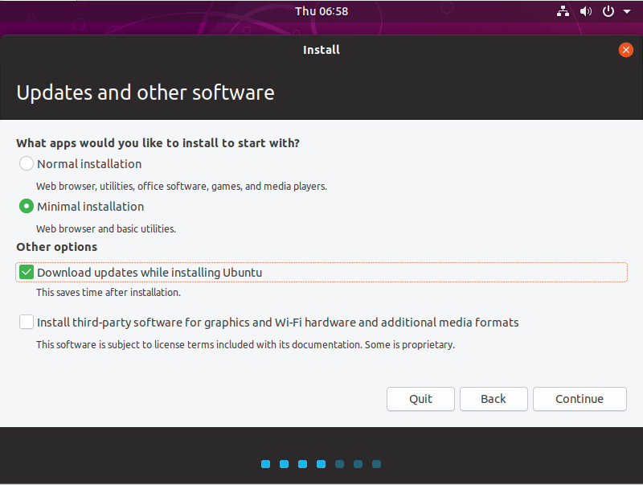
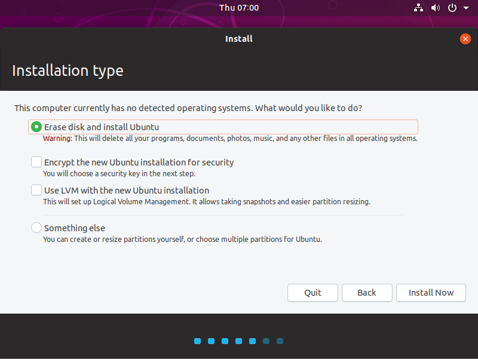
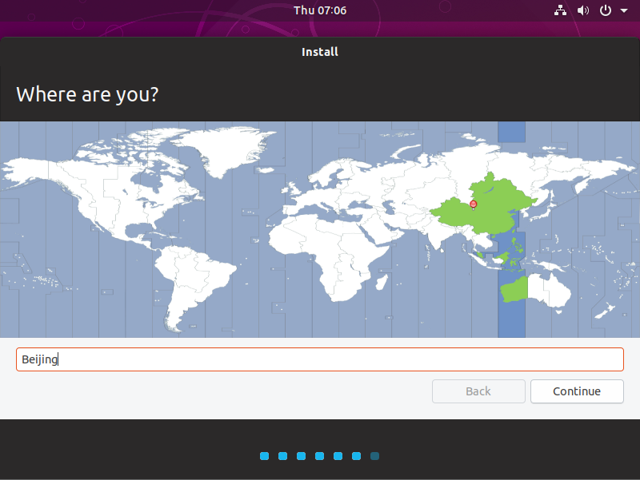
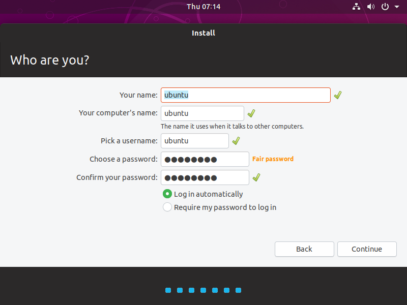

# 安装 Ubuntu18 操作系统

## 安装操作系统
1.  开机 -> 等待系统进入安装界面 
     
2.  语言选择：English -> Install Ubuntu -> 键盘布局：English English(US) -> 更新和其他软件：最小安装 安装时下载更新 -> 安装方式：清盘安装 -> 选择地区 -> 设置用户 -> 开始安装 
     
     
     
     
     
     

    > 用户：ubuntu 密码：1qaz2wsx