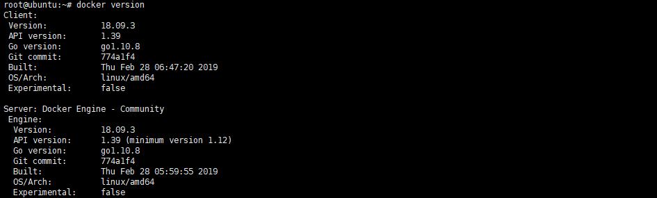

# Ubuntu18 安装 Docker

## 软件安装

1.  获得临时的root权限，打开终端输入以下命令，之后直接输入当前账户的密码，就可以获得临时的root权限<br>

    ```命令
    > sudo -s
    ```

2.  安装必要的一些系统工具<br>

    ```命令
    > apt-get update
    > apt-get -y install apt-transport-https ca-certificates curl software-properties-common
    ```

3.  安装GPG证书<br>

    ```命令
    > curl -fsSL http://mirrors.aliyun.com/docker-ce/linux/ubuntu/gpg | sudo apt-key add -
    ```

4.  写入软件源信息<br>

    ```命令
    > add-apt-repository "deb [arch=amd64] http://mirrors.aliyun.com/docker-ce/linux/ubuntu $(lsb_release -cs) stable"
    ```

5.  更新并安装Docker-CE<br>

    ```命令
    > apt-get -y update
    > apt-get -y install docker-ce
    ```

6.  安装校验<br>

    <br> 

7.  创建docker目录，并赋值权限<br>

    ```命令
    > gpasswd -a ubuntu docker
    > mkdir /home/docker/
    > chown -R ubuntu:ubuntu /home/docker/
    ```