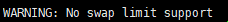

# Ubuntu18 安装 Docker

## 软件安装

1.  获得临时的root权限，打开终端输入以下命令，之后直接输入当前账户的密码，就可以获得临时的root权限<br>

    ```命令
    > sudo -s
    ```

2.  安装必要的一些系统工具<br>

    ```命令
    > apt-get update
    > apt-get -y install apt-transport-https ca-certificates curl software-properties-common
    ```

3.  安装GPG证书<br>

    ```命令
    > curl -fsSL http://mirrors.aliyun.com/docker-ce/linux/ubuntu/gpg | sudo apt-key add -
    ```

4.  写入软件源信息<br>

    ```命令
    > add-apt-repository "deb [arch=amd64] http://mirrors.aliyun.com/docker-ce/linux/ubuntu $(lsb_release -cs) stable"
    ```

5.  更新并安装Docker-CE<br>

    ```命令
    > apt-get -y update
    > apt-get -y install docker-ce
    ```

6.  安装校验<br>

    <br> 

7.  创建docker目录，并赋值权限<br>

    ```命令
    > gpasswd -a ubuntu docker
    > mkdir /home/docker/
    > chown -R ubuntu:ubuntu /home/docker/
    ```

8.  设置镜像加速<br>
    a. 添加文件daemon.json<br>

    ```命令
    > vim /etc/docker/daemon.json
    ```

    ```内容
    {
      "registry-mirrors": [
        "https://registry.docker-cn.com"
      ]
    }
    ```

    b. 重启Docker<br>

    ```命令
    > service docker restart
    ```

    c. 验证是否增加成功<br>

    ```命令
    > docker info
    ```

    <br>

9.  添加内核参数<br>

    > ![info][info] 执行docker info出现告警时进行操作<br>
    > <br>

    a. 修改文件grub<br>

    ```命令
    > vim /etc/default/grub
    ```

    ```内容
    GRUB_DEFAULT=0
    GRUB_HIDDEN_TIMEOUT=0
    GRUB_HIDDEN_TIMEOUT_QUIET=true
    GRUB_TIMEOUT=10
    GRUB_DISTRIBUTOR=lsb_release -i -s 2> /dev/null || echo Debian
    GRUB_CMDLINE_LINUX_DEFAULT=“cgroup_enable=memory swapaccount=1”
    GRUB_CMDLINE_LINUX=""
    ```

    b. 重新加载grub并重启系统<br>

    ```命令
    > update-grub
    > reboot
    ```

    c. 验证是否增加成功<br>

    ```命令
    > docker info
    ```

[info]: /images/info.png