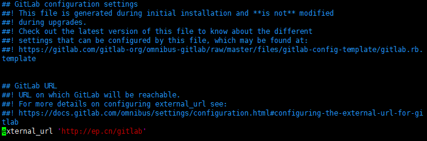

# Docker 安装 Gitlab-ce-zh

## 软件安装

1.  Docker获取最新版中文版Gitlab<br>

    ```命令
    > docker pull twang2218/gitlab-ce-zh
    ```

    > ![info][info] [twang2218/gitlab-ce-zh说明地址][gitlab-ce-zh地址]

2.  Docker创建归属gitlab使用的网络<br>

    ```命令
    > docker network create -d bridge gitlab-net
    ```

3.  Docker运行gitlab-ce-zh<br>
    a. 拷贝运行脚本到特定目录<br>

    > [start-container.sh](files/02/start-container.sh) -> /home/docker/gitlab/<br>

    b. 设置执行权限<br>

    ```命令
    > chmod +x /home/docker/gitlab/*.sh
    ```

    c. 运行Gitlab-ce-zh<br>

    ```命令
    > cd /home/docker/gitlab/
    > ./start-container.sh
    ```

4.  验证Docker运行结果<br>

    ```命令
    > docker ps
    ```

5.  Nginx添加访问跳转<br>
    a. 修改gitlab.rb配置<br>

    ```命令
    > sudo vim /home/docker/gitlab/etc/gitlab.rb
    ```

    ```内容
    external_url 'http://ep.cn/gitlab'
    ```

    <br>

    b. Docker重启gitlab<br>

    ```命令
    > docker restart gitlab
    ```

    c. 添加Nginx配置<br>

    ```命令
    > sudo vim /home/docker/nginx/etc/conf.d/default.conf
    ```

    ```内容
    server {
       …
       client_max_body_size 1g;
       …
       location ^~ /gitlab {
            proxy_pass http://localhost:3080/gitlab/;
            proxy_set_header Host $host:80;
            proxy_set_header X-Real-IP $remote_addr;
            proxy_set_header X-Forwarded-For $proxy_add_x_forwarded_for;
        }
        …
    }
    ```

    d. 验证Nginx配置<br>

    ```命令
    > docker run -it \
                 -v /home/docker/nginx/etc/nginx.conf:/etc/nginx/nginx.conf:ro \
                 -v /home/docker/nginx/etc/conf.d:/etc/nginx/conf.d \
                 nginx \
                 nginx -t -c /etc/nginx/nginx.conf
    ```

    e. Docker重启nginx<br>

    ```命令
    > docker restart nginx
    ```

    f. 验证gitlab是否运行正常<br>

    > ![info][info] 访问http\://\<宿主机ip>/gitlab -> 设置root密码1qaz2wsx

[info]: /images/info.png

[gitlab-ce-zh地址]: https://hub.docker.com/r/twang2218/gitlab-ce-zh/
