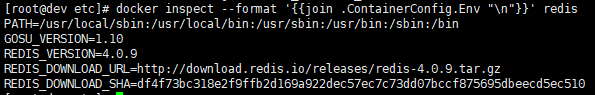
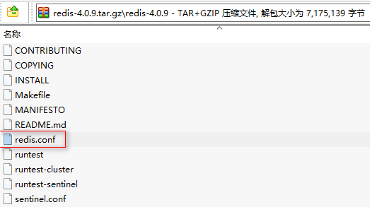
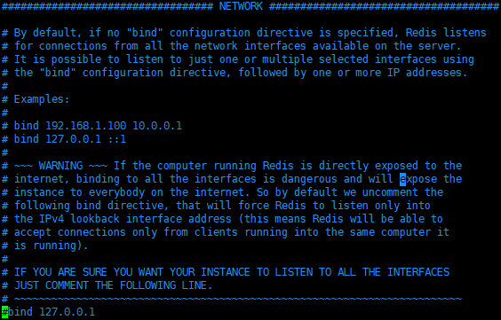
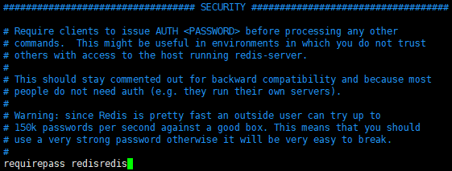
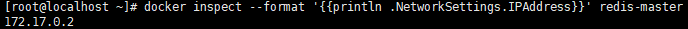
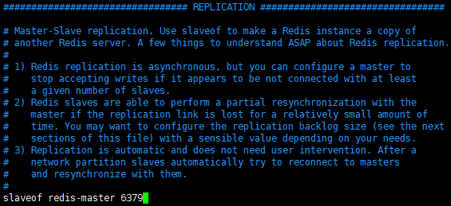
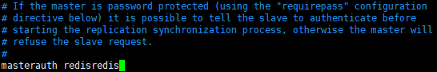

# Docker 安装 Redis 集群

## 软件安装

1.  Docker获取最新版Redis<br>

    ```命令
    > docker pull redis
    ```

    > ![info][info] [redis说明地址][redis地址]

2.  创建Redis宿主目录(配置etc)<br>

    ```命令
    > mkdir -p /home/docker/redis/etc
    ```

3.  获取Redis当前版本默认配置<br>
    a. 查询Docker镜像当前版本<br>

    ```命令
    > docker inspect --format '{{join .ContainerConfig.Env "\n"}}' redis
    ```

    <br>

    b. 根据REDIS_DOWNLOAD_URL下载tar.gz包<br>

    c. 获取redis.conf文件并上传到/home/docker/redis/etc目录<br>

    <br>

4.  修改redis.conf为master.conf<br>

    ```命令
    > mv /home/docker/redis/etc/redis.conf /home/docker/redis/etc/master.conf
    ```

5.  修改master.conf<br>

    ```命令
    > vim /home/docker/redis/etc/master.conf
    ```

    a. 注释默认的"bind 127.0.0.1"<br>

    <br>

    > ![info][info] 注释后可使Redis被全网访问

    b. 增加密码<br>

    <br>

    > ![info][info] 增加密码，访问Redis时需要上送密码，可使Redis更加安全

6.  Docker运行Redis的master<br>

    ```命令
    > docker run -d \
                 -p 6379:6379 \
                 --name redis-master \
                 --restart unless-stopped \
                 -v /home/docker/redis/data/master/:/data \
                 -v /home/docker/redis/etc/master.conf:/etc/redis/redis.conf \
                 redis \
                 redis-server /etc/redis/redis.conf
    ```

7.  打开防火墙端口<br>
    a. 查看当前活动防火墙策略<br>

    ```命令
    > sudo firewall-cmd --zone=public --list-all
    ```

    b. 为防火墙策略增加允许端口<br>

    ```命令
    > sudo firewall-cmd --zone=public --add-port=6379/tcp --permanent
    ```

    c. 重启防火墙<br>

    ```命令
    > sudo firewall-cmd --reload
    ```

    d. 查看是否添加成功<br>

    ```命令
    > sudo firewall-cmd --zone=public --list-all
    ```

8.  Docker查看master的IP地址<br>

    ```命令
    > docker inspect --format '{{println .NetworkSettings.IPAddress}}' redis-master
    ```

    <br>


9.  拷贝master.conf为slave.conf<br>

    ```命令
    > cp /home/docker/redis/etc/master.conf /home/docker/redis/etc/slave.conf
    ```

10. 修改slave.conf<br>

    ```命令
    > vim /home/docker/redis/etc/slave.conf
    ```

    a. 配置主机地址端口<br>

    <br>

    b. 配置主机密码<br>

    <br>

11. Docker运行Redis的slave<br>

    ```命令
    > docker run -d \
                 -p 6380:6379 \
                 --name redis-slave1 \
                 --restart unless-stopped \
                 -v /home/docker/redis/data/slave1/:/data \
                 -v /home/docker/redis/etc/slave.conf:/etc/redis/redis.conf \
                 redis \
                 redis-server /etc/redis/redis.conf
    ```

12. 打开防火墙端口<br>
    a. 查看当前活动防火墙策略<br>


    ```命令
    > sudo firewall-cmd --zone=public --list-all
    ```

    b. 为防火墙策略增加允许端口<br>

    ```命令
    > sudo firewall-cmd --zone=public --add-port=6380/tcp --permanent
    ```

    c. 重启防火墙<br>

    ```命令
    > sudo firewall-cmd --reload
    ```

    d. 查看是否添加成功<br>

    ```命令
    > sudo firewall-cmd --zone=public --list-all
    ```

[info]: /images/info.png

[redis地址]: https://hub.docker.com/_/redis/
