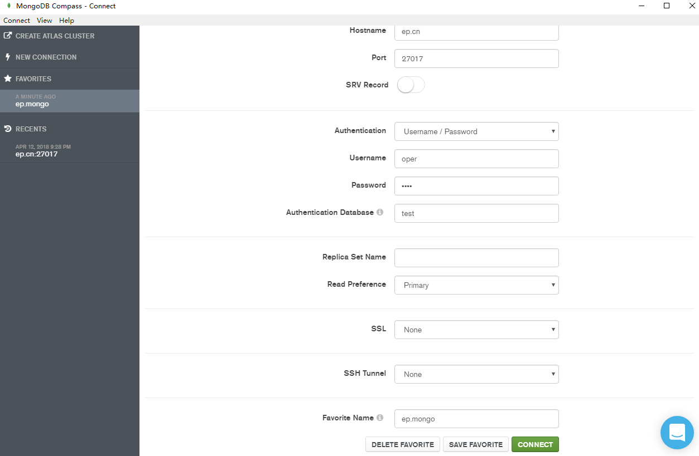

# Docker 安装 MongoDB

## 软件安装

1.  Docker获取最新版MongoDB<br>

    ```命令
    > docker pull mongo
    ```

    > ![info][info] [mongo说明地址][mongo地址]

2.  Docker运行MongoDB<br>
    a. 拷贝运行脚本到特定目录<br>

    > [start-container.sh](files/04/start-container.sh) -> /home/docker/mongo/<br>

    b. 设置执行权限<br>

    ```命令
    > chmod +x /home/docker/mongo/*.sh
    ```

    c. 运行MongoDB<br>

    ```命令
    > cd /home/docker/mongo/
    > ./start-container.sh
    ```

3.  MongoDB用户管理<br>
    a. 通过Docker进入管理命令行<br>

    ```命令
    > docker exec -it mongo mongo admin
    ```

    <br>

    b. 创建管理员<br>

    ```命令
    > db.createUser(
         {
           user: "dba",
           pwd: "dba",
           roles: [ { role: "userAdminAnyDatabase", db: "admin" } ]
         }
      )
    ```

    c. 验证管理员是否创建成功<br>

    ```命令
    > db.auth("dba","dba")
    ```

    > ![info][info] 返回1则验证成功，0则验证失败

    d. 创建test数据库及test数据库用户<br>

    ```命令
    > use test
    > db.createUser(
         {
           user: "oper",
           pwd: "oper",
           roles: [ { role: "readWrite", db: "test" } ]
         }
       )
    ```

    e. 退出<br>

    ```命令
    > exit
    ```

    f. 通过Docker验证管理员用户是否可以进入test数据库<br>

    ```命令
    > docker run -it --rm --link mongo:mongo mongo mongo -u dba -p dba --authenticationDatabase admin mongo/test
    ```

4.  打开防火墙端口<br>
    a. 查看当前活动防火墙策略<br>

    ```命令
    > sudo firewall-cmd --zone=public --list-all
    ```

    b. 为防火墙策略增加允许端口<br>

    ```命令
    > sudo firewall-cmd --zone=public --add-port=27017/tcp --permanent
    ```

    c. 重启防火墙<br>

    ```命令
    > sudo firewall-cmd --reload
    ```

    d. 查看是否添加成功<br>

    ```命令
    > sudo firewall-cmd --zone=public --list-all
    ```

5.  工具验证连接Mongo<br>

    <br>
    <br>

[info]: /images/info.png

[mongo地址]: https://hub.docker.com/_/mongo/

[mongo配置地址]: https://docs.mongodb.com/manual/reference/configuration-options/
