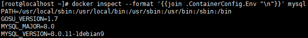
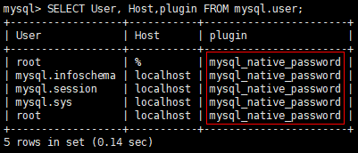
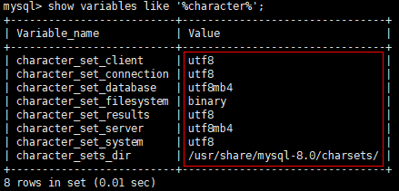
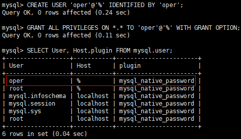

# Docker 安装 Mysql

## 软件安装

1.  Docker获取最新版Mysql<br>

    ```命令
    > docker pull mysql
    ```

    > ![info][info] [mysql说明地址][mysql地址]


2.  创建Mysql宿主目录(配置etc)<br>

    ```命令
    > mkdir -p /home/docker/mysql/etc/conf.d
    ```

3.  增加Mysql当前版本默认配置<br>
    a. 查询Docker镜像当前版本<br>

    ```命令
    > docker inspect --format '{{join .ContainerConfig.Env "\n"}}' mysql
    ```

    <br>

    b. 增加版本默认配置

    ```命令
    > vim /home/docker/mysql/etc/conf.d/default.cnf
    ```

    ```内容
    [mysqld]
    default_authentication_plugin=mysql_native_password
    ```

    > ![info][info] mysql8默认使用caching_sha2_password


4.  Docker运行Mysql<br>

    ```命令
    > docker run -d \
                 -p 3306:3306 \
                 --name mysql \
                 --restart unless-stopped \
                 -v /home/docker/mysql/etc/conf.d:/etc/mysql/conf.d \
                 -v /home/docker/mysql/data:/var/lib/mysql \
                 -e MYSQL_ROOT_PASSWORD=1qaz2wsx \
                 mysql
    ```

    ```命令
    > chcon -Rt svirt_sandbox_file_t /home/docker/mysql/etc/conf.d
    > chcon -Rt svirt_sandbox_file_t /home/docker/mysql/data
    ```

    > ![info][info] 由于centos7可能开启SELinux,需要使用命令增加相关路径文件的权限

5.  Mysql管理及设置
    a. Docker链接mysql<br>

    ```命令
    > docker run -it --link mysql:mysql --rm mysql sh -c 'exec mysql -h"$MYSQL_PORT_3306_TCP_ADDR" -P"$MYSQL_PORT_3306_TCP_PORT" -uroot -p"$MYSQL_ENV_MYSQL_ROOT_PASSWORD"'
    ```

    b. 验证用户密码类型<br>

    ```命令
    > SELECT User, Host, plugin FROM mysql.user;
    ```

    <br>

    c. 设置编码集<br>

    ```命令
    > SET NAMES 'utf8';
    > show variables like '%character%';
    ```

    <br>

    d. 创建远程可操作的用户<br>

    ```命令
    > CREATE USER 'oper'@'%' IDENTIFIED BY 'oper';
    > GRANT ALL PRIVILEGES ON *.* TO 'oper'@'%' WITH GRANT OPTION;
    > SELECT User, Host, plugin FROM mysql.user;
    ```

    <br>

6.  打开防火墙端口<br>
    a. 查看当前活动防火墙策略<br>

    ```命令
    > sudo firewall-cmd --zone=public --list-all
    ```

    b. 为防火墙策略增加允许端口<br>

    ```命令
    > sudo firewall-cmd --zone=public --add-port=3306/tcp --permanent
    ```

    c. 重启防火墙<br>

    ```命令
    > sudo firewall-cmd --reload
    ```

    d. 查看是否添加成功<br>

    ```命令
    > sudo firewall-cmd --zone=public --list-all
    ```

[info]: /images/info.png

[mysql地址]: https://hub.docker.com/_/mysql/
