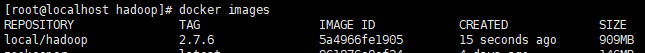
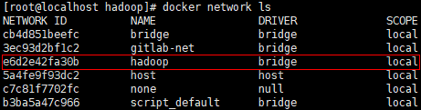
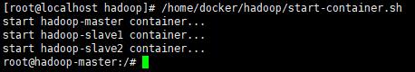
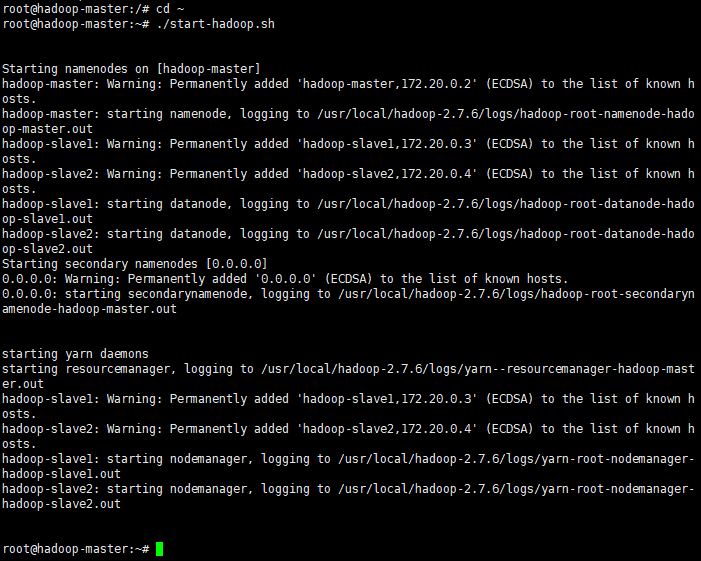
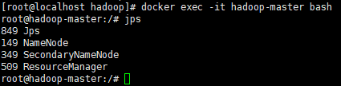
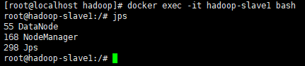
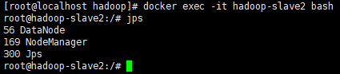
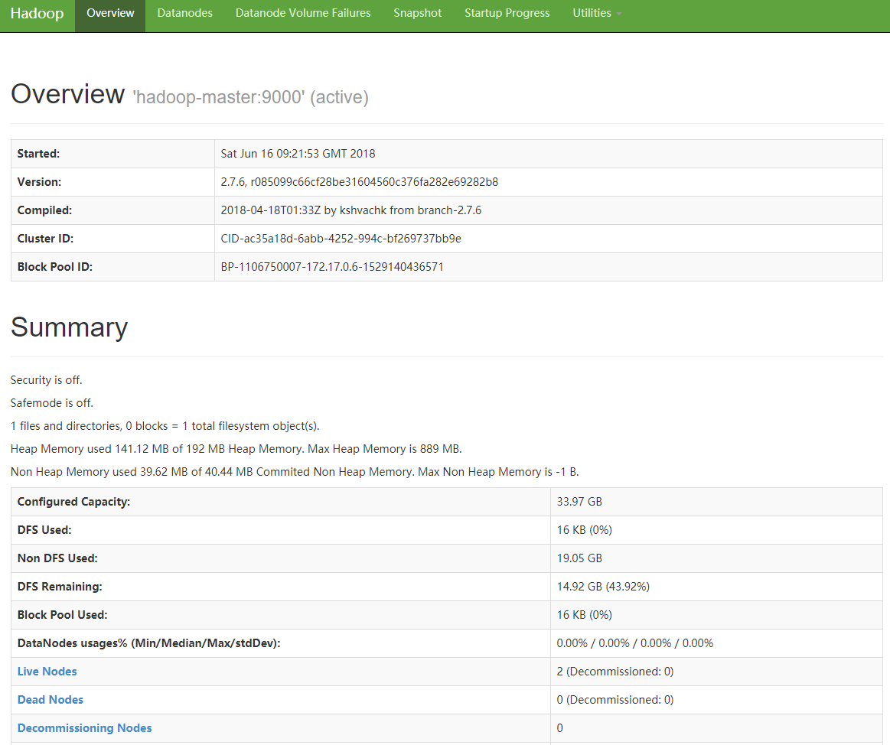
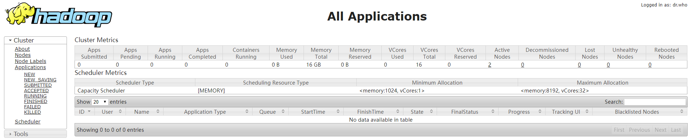

# Docker 安装 Hadoop2.7.6 集群

## 软件安装

1.  Docker获取最新版Ubuntu<br>

    ```命令
    > docker pull ubuntu:18.04
    ```

    > ![info][info] [ubuntu说明地址][ubuntu地址]

2.  创建Hadoop宿主目录(Dockerfile脚本及配置)<br>

    ```命令
    > mkdir -p /home/docker/hadoop
    ```

3.  编写Dockerfile创建Hadoop镜像脚本<br>
    a. 创建Dockerfile文件<br>

    ```命令
    > touch /home/docker/hadoop/Dockerfile
    ```

    b. 编写Docker构建内容<br>

    > ![info][info] [Dockerfile](files/07/Dockerfile)脚本说明<br>
    > 1.依赖ubuntu:18.04<br>
    > 2.使用root用户<br>
    > 3.安装必要工具(ssh及jdk8)<br>
    > 4.从宿主机器拷贝hadoop-2.7.6.tar.gz(需要在编译前提前准备好文件)并自动解压，同时做关联操作<br>
    > 5.设置环境变量<br>
    > 6.设置无秘登录<br>
    > 7.从宿主机器拷贝配置预设好的必要配置到特定目录(slaves文件要提前修改好)<br>
    > 8.设置启动shell脚本执行权限<br>
    > 9.设置hadoop的namenode<br>
    > 10.启动后预初始化执行启动ssh<br>

4.  补充Dockerfile编译脚本相关文件及使用配置<br>
    a. 下载hadoop-2.7.6.tar.gz<br>

    > [hadoop-2.7.6下载地址](http://www.apache.org/dyn/closer.cgi/hadoop/common/hadoop-2.7.6/hadoop-2.7.6.tar.gz)

    b. 拷贝文件到特定目录<br>

    > [build-image.sh](files/07/build-image.sh) -> /home/docker/hadoop/<br>
    > [start-container.sh](files/07/start-container.sh) -> /home/docker/hadoop/<br>
    > [config/core-site.xml](files/07/config/core-site.xml) -> /home/docker/hadoop/config/<br>
    > [config/hadoop-env.sh](files/07/config/hadoop-env.sh) -> /home/docker/hadoop/config/<br>
    > [config/hdfs-site.xml](files/07/config/hdfs-site.xml) -> /home/docker/hadoop/config/<br>
    > [config/mapred-site.xml](files/07/config/mapred-site.xml) -> /home/docker/hadoop/config/<br>
    > [config/run-wordcount.sh](files/07/config/run-wordcount.sh) -> /home/docker/hadoop/config/<br>
    > [config/slaves](files/07/config/slaves) -> /home/docker/hadoop/config/<br>
    > [config/ssh_config](files/07/config/ssh_config) -> /home/docker/hadoop/config/<br>
    > [config/start-hadoop.sh](files/07/config/start-hadoop.sh) -> /home/docker/hadoop/config/<br>
    > [config/yarn-site.xml](files/07/config/yarn-site.xml) -> /home/docker/hadoop/config/<br>

    c. 设置执行权限<br>

    ```命令
    > chmod +x /home/docker/hadoop/*.sh
    ```

5.  依赖Dockerfile构建镜像<br>
    a. 执行构建脚本<br>

    ```命令
    > cd /home/docker/hadoop/
    > ./build-image.sh
    ```

    b. 验证构建结果<br>

    ```命令
    > docker images
    ```

    <br>

6.  运行Hadoop集群<br>
    a. 创建hadoop专属docker网络环境<br>

    ```命令
    > docker network create --driver=bridge hadoop
    ```

    b. 验证docker网络环境创建结果<br>

    ```命令
    > docker network ls
    ```

    <br>

    c. 运行hadoop集群<br>

    ```命令
    > cd /home/docker/hadoop/
    > ./start-container.sh
    ```

    <br>

    > ![info][info] 容器启动成功后会自动进入hadoop-master容器

    ```命令
    > cd ~
    > ./start-hadoop.sh
    ```

    <br>

    d. 验证是否启动成功

    ```命令
    > docker exec -it hadoop-master bash
    > docker exec -it hadoop-slave1 bash
    > docker exec -it hadoop-slave2 bash
    ```

    <br>
    <br>
    <br>

    > [访问Name Node页面:\[Your IP Address\]:50070/](http://ep.cn:50070)
    > [访问Resource Manager页面:\[Your IP Address\]:8088/](http://ep.cn:8088)

    <br>
    <br>

7.  打开防火墙端口<br>
    a. 查看当前活动防火墙策略<br>

    ```命令
    > sudo firewall-cmd --zone=public --list-all
    ```

    b. 为防火墙策略增加允许端口<br>

    ```命令
    > sudo firewall-cmd --zone=public --add-port=50070/tcp --add-port=9000/tcp --add-port=8088/tcp --permanent
    ```

    c. 重启防火墙<br>

    ```命令
    > sudo firewall-cmd --reload
    ```

    d. 查看是否添加成功<br>

    ```命令
    > sudo firewall-cmd --zone=public --list-all
    ```

[info]: /images/info.png

[ubuntu地址]: https://hub.docker.com/_/ubuntu/
