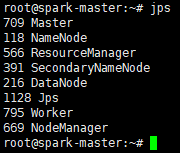
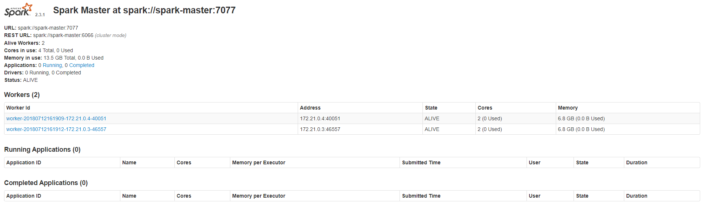

# Docker 安装 Spark2.3.1 集群

## 软件安装

1.  Docker获取最新版Ubuntu<br>

    ```命令
    > docker pull ubuntu:18.04
    ```

    > ![info][info] [ubuntu说明地址][ubuntu地址]

2.  创建Spark宿主目录(Dockerfile脚本及配置)<br>

    ```命令
    > mkdir -p /home/docker/spark/config /home/docker/spark/script/core/config
    ```
    
3.  编写Dockerfile创建Spark镜像脚本<br>
    a. 创建Dockerfile文件<br>

    ```命令
    > touch /home/docker/spark/script/core/Dockerfile
    ```

    b. 编写Docker构建内容<br>

    > ![info][info] [Dockerfile](files/08/script/core/Dockerfile)脚本说明<br>
    > 1.依赖ubuntu:18.04<br>
    > 2.使用root用户<br>
    > 3.安装必要工具(ssh及jdk8)<br>
    > 4.从宿主机器拷贝hadoop-2.7.6.tar.gz(需要在编译前提前准备好文件)并自动解压，同时做关联操作<br>
    > 5.从宿主机器拷贝spark-2.3.1-bin-hadoop2.7.tgz(需要在编译前提前准备好文件)并自动解压，同时做关联操作<br>
    > 6.从宿主机器拷贝scala-2.12.6.tgz(需要在编译前提前准备好文件)并自动解压，同时做关联操作<br>
    > 7.设置环境变量<br>
    > 8.从宿主机器拷贝预设好的必要配置到特定目录<br>
    > 9.设置无秘登录<br>
    > 10.移动配置到hadoop的配置目录中<br>
    > 11.移动配置到spark的配置目录中<br>
    > 12.设置工作目录为hadoop的根目录<br>
    > 13.设置hadoop的namenode<br>
    > 14.设置工作目录为spark的根目录<br>
    > 15.导出需要使用的的端口<br>
    > 16.启动后预初始化执行启动ssh<br>

4.  补充Dockerfile编译脚本相关文件及使用配置<br>
    a. 下载hadoop-2.7.6.tar.gz<br>

    > [hadoop-2.7.6下载地址](http://www.apache.org/dyn/closer.cgi/hadoop/common/hadoop-2.7.6/hadoop-2.7.6.tar.gz)
    
    b. 下载spark-2.3.1-bin-hadoop2.7.tgz<br>

    > [spark-2.3.1下载地址](https://www.apache.org/dyn/closer.lua/spark/spark-2.3.1/spark-2.3.1-bin-hadoop2.7.tgz)

    c. 下载scala-2.12.6.tgz<br>

    > [scale-2.12.6下载地址](https://downloads.lightbend.com/scala/2.12.6/scala-2.12.6.tgz)

    d. 拷贝文件到特定目录<br>

    > [script/core/build-image.sh](files/08/script/core/build-image.sh) -> /home/docker/spark/script/core/<br>
    > [script/core/config/core-site.xml](files/08/script/core/config/core-site.xml) -> /home/docker/spark/script/core/config/<br>
    > [script/core/config/hadoop-env.sh](files/08/script/core/config/hadoop-env.sh) -> /home/docker/spark/script/core/config/<br>
    > [script/core/config/hdfs-site.xml](files/08/script/core/config/hdfs-site.xml) -> /home/docker/spark/script/core/config/<br>
    > [script/core/config/mapred-site.xml](files/08/script/core/config/mapred-site.xml) -> /home/docker/spark/script/core/config/<br>
    > [script/core/config/spark-env.sh](files/08/script/core/config/spark-env.sh) -> /home/docker/spark/script/core/config/<br>
    > [script/core/config/ssh_config](files/08/script/core/config/ssh_config) -> /home/docker/spark/script/core/config/<br>
    > [script/core/config/start-spark.sh](files/08/script/core/config/start-spark.sh) -> /home/docker/spark/script/core/config/<br>
    > [script/core/config/yarn-site.xml](files/08/script/core/config/yarn-site.xml) -> /home/docker/spark/script/core/config/<br>

    e. 设置执行权限<br>

    ```命令
    > chmod +x /home/docker/spark/script/core/*.sh
    ```

5.  依赖Dockerfile构建镜像<br>
    a. 执行构建脚本<br>

    ```命令
    > cd /home/docker/spark/script/core/
    > ./build-image.sh
    ```

    b. 验证构建结果<br>

    ```命令
    > docker images
    ```

    <br>

6.  Spark环境准备<br>
    a. 创建spark专属docker网络环境<br>

    ```命令
    > docker network create --driver=bridge bigdata-net
    ```

    b. 验证docker网络环境创建结果<br>

    ```命令
    > docker network ls
    ```

    <br>

7.  运行Spark单机模式<br>
    a. 拷贝文件到特定目录<br>

    > [script/dc-spark-standalone.yml](files/08/script/dc-spark-standalone.yml) -> /home/docker/spark/script/<br>
    > [start-container-standalone.sh](files/08/start-container-standalone.sh) -> /home/docker/spark/<br>

    b. 执行启动脚本<br>

    ```命令
    > chmod +x /home/docker/spark/*.sh
    > cd /home/docker/spark/
    > ./start-container-standalone.sh
    ```

    <br>

    > ![info][info] 容器启动成功后会自动进入spark-master容器

    ```命令
    > cd ~
    > ./start-spark.sh
    ```

    <br>

    c. 验证是否启动成功

    ```命令
    > jps
    ```

    <br>

    > [访问Name Node页面:\[Your IP Address\]:50070/](http://ep.cn:50070)<br>
    > [访问Resource Manager页面:\[Your IP Address\]:8088/](http://ep.cn:8088)<br>

    <br>
    <br>

    > [访问Spark Info页面:\[Your IP Address\]:8080/](http://ep.cn:8080)<br>

    <br>

    > 在spark-master容器中执行spark-shell,可用scala语言进行任务操作<br>
    > 可用[访问Spark 任务页面:\[Your IP Address\]:4040/](http://ep.cn:4040)查看任务信息

    <br>
    <br>

8.  运行Spark集群模式<br>
    a. 拷贝文件到特定目录<br>

    > [config/hdfs-site.xml](files/08/config/hdfs-site.xml) -> /home/docker/spark/config/<br>
    > [script/dc-spark-cluster.yml](files/08/script/dc-spark-cluster.yml) -> /home/docker/spark/script/<br>
    > [start-container-cluster.sh](files/08/start-container-cluster.sh) -> /home/docker/spark/<br>

    b. 执行启动脚本<br>

    ```命令
    > chmod +x /home/docker/spark/*.sh
    > cd /home/docker/spark/
    > ./start-container-cluster.sh 3
    ```

    <br>

    > ![info][info] 容器启动成功后会自动进入spark-master容器

    ```命令
    > cd ~
    > ./start-spark.sh
    ```

    <br>

    c. 验证是否启动成功

    ```命令
    > jps
    ```

    <br>
    <br>
    <br>

    > [访问Name Node页面:\[Your IP Address\]:50070/](http://ep.cn:50070)<br>
    > [访问Resource Manager页面:\[Your IP Address\]:8088/](http://ep.cn:8088)<br>

    <br>
    <br>

    > [访问Spark Info页面:\[Your IP Address\]:8080/](http://ep.cn:8080)<br>

    <br>

    > 在spark-master容器中执行spark-shell,可用scala语言进行任务操作<br>
    > 可用[访问Spark 任务页面:\[Your IP Address\]:4040/](http://ep.cn:4040)查看任务信息

    <br>
    <br>

9.  打开防火墙端口<br>
    a. 查看当前活动防火墙策略<br>

    ```命令
    > sudo firewall-cmd --zone=public --list-all
    ```

    b. 为防火墙策略增加允许端口<br>

    ```命令
    > sudo firewall-cmd --zone=public --add-port=50070/tcp --add-port=9000/tcp --add-port=8088/tcp --add-port=7077/tcp --add-port=8080/tcp --add-port=4040/tcp --permanent
    ```

    c. 重启防火墙<br>

    ```命令
    > sudo firewall-cmd --reload
    ```

    d. 查看是否添加成功<br>

    ```命令
    > sudo firewall-cmd --zone=public --list-all
    ```

[info]: /images/info.png

[ubuntu地址]: https://hub.docker.com/_/ubuntu/