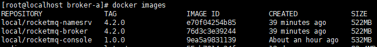
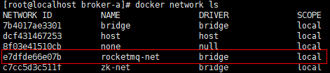
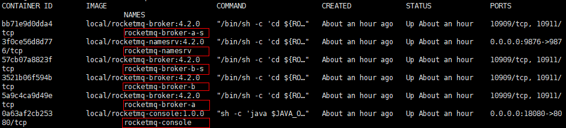
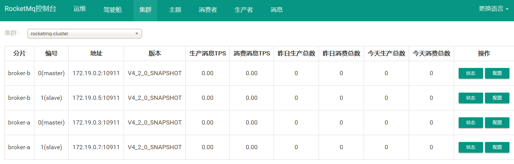

# Docker 安装 RocketMQ4.2.0 集群

## 软件安装

1.  Docker获取最新版Ubuntu<br>

    ```命令
    > docker pull ubuntu:18.04
    ```

    > ![info][info] [ubuntu说明地址][ubuntu地址]

2.  创建RocketMQ宿主目录(Dockerfile脚本及配置)<br>

    ```命令
    > mkdir -p /home/docker/rocketmq/script/namesrv /home/docker/rocketmq/script/broker /home/docker/rocketmq/script/console
    > mkdir -p /home/docker/rocketmq/broker-a/conf /home/docker/rocketmq/broker-a-s/conf /home/docker/rocketmq/broker-b/conf /home/docker/rocketmq/broker-b-s/conf
    ```

3.  编写Dockerfile创建RocketMQ镜像脚本<br>
    a. 创建Dockerfile文件<br>

    ```命令
    > touch /home/docker/rocketmq/script/namesrv/Dockerfile
    > touch /home/docker/rocketmq/script/broker/Dockerfile
    > touch /home/docker/rocketmq/script/console/Dockerfile
    ```
    b. 编写Docker构建namesrv内容<br>

    > ![info][info] [Dockerfile](files/09/script/namesrv/Dockerfile)脚本说明<br>
    > 1.依赖ubuntu:18.04<br>
    > 2.使用root用户<br>
    > 3.安装必要工具(jdk8,zip,unzip)<br>
    > 4.从宿主机器拷贝rocketmq-all-4.2.0-bin-release.zip(需要在编译前提前准备好文件)<br>
    > 5.设置环境变量<br>
    > 6.创建相关使用目录<br>
    > 7.导出使用端口<br>
    > 8.映射硬盘路径<br>
    > 9.启动后预初始化执行启动mqnamesrv<br>

    c. 编写Docker构建broker内容<br>

    > ![info][info] [Dockerfile](files/09/script/broker/Dockerfile)脚本说明<br>
    > 1.依赖ubuntu:18.04<br>
    > 2.使用root用户<br>
    > 3.安装必要工具(jdk8,zip,unzip)<br>
    > 4.从宿主机器拷贝rocketmq-all-4.2.0-bin-release.zip(需要在编译前提前准备好文件)<br>
    > 5.设置环境变量<br>
    > 6.创建相关使用目录<br>
    > 7.导出使用端口<br>
    > 8.映射硬盘路径<br>
    > 9.启动后预初始化执行启动mqbroker<br>

    d. 编写Docker构建console内容<br>

    > ![info][info] [Dockerfile](files/09/script/console/Dockerfile)脚本说明<br>
    > 1.依赖ubuntu:18.04<br>
    > 2.使用root用户<br>
    > 3.安装必要工具(jdk8,zip,unzip)<br>
    > 4.从宿主机器拷贝rocketmq-console-ng-1.0.0.jar(需要在编译前提前准备好文件)<br>
    > 5.设置环境变量<br>
    > 6.启动后预初始化执行jar<br>

4.  补充Dockerfile编译脚本相关文件及使用配置<br>
    a. 下载rocketmq-all-4.2.0-bin-release.zip<br>

    > [rocketmq-4.2.0下载地址](https://www.apache.org/dyn/closer.cgi?path=rocketmq/4.2.0/rocketmq-all-4.2.0-bin-release.zip)

    d. 拷贝文件到特定目录<br>

    > [script/namesrv/build-image.sh](files/09/script/namesrv/build-image.sh) -> /home/docker/rocketmq/script/namesrv/<br>
    > [script/broker/build-image.sh](files/09/script/broker/build-image.sh) -> /home/docker/rocketmq/script/broker/<br>
    > [script/console/build-image.sh](files/09/script/console/build-image.sh) -> /home/docker/rocketmq/script/console/<br>
    > [script/console/rocketmq-console-ng-1.0.0.jar](files/09/script/console/rocketmq-console-ng-1.0.0.jar) -> /home/docker/rocketmq/script/console/<br>
    > [script/dc-rocketmq.yml](files/09/script/dc-rocketmq.yml) -> /home/docker/rocketmq/script/<br>
    > [conf/broker-a/broker.properties](files/09/conf/broker-a/broker.properties) -> /home/docker/rocketmq/broker-a/conf/<br>
    > [conf/broker-a-s/broker.properties](files/09/conf/broker-a-s/broker.properties) -> /home/docker/rocketmq/broker-a-s/conf/<br>
    > [conf/broker-b/broker.properties](files/09/conf/broker-b/broker.properties) -> /home/docker/rocketmq/broker-b/conf/<br>
    > [conf/broker-b-s/broker.properties](files/09/conf/broker-b-s/broker.properties) -> /home/docker/rocketmq/broker-b-s/conf/<br>

    e. 设置执行权限<br>

    ```命令
    > chmod +x /home/docker/rocketmq/script/namesrv/*.sh
    > chmod +x /home/docker/rocketmq/script/broker/*.sh
    > chmod +x /home/docker/rocketmq/script/console/*.sh
    ```

5.  依赖Dockerfile构建镜像<br>
    a. 执行构建脚本<br>

    ```命令
    > cd /home/docker/rocketmq/script/namesrv
    > ./build-image.sh
    > cd /home/docker/rocketmq/script/broker
    > ./build-image.sh 
    > cd /home/docker/rocketmq/script/console
    > ./build-image.sh  
    ```

    b. 验证构建结果<br>

    ```命令
    > docker images
    ```

    <br>

6. 创建rocketmq专属docker网络环境<br>

    ```命令
    > docker network create --driver=bridge rocketmq-net
    ```

    <br>

7. Docker运行RocketMQ集群<br>
    a. 拷贝运行脚本到特定目录<br>

    > [start-container.sh](files/09/start-container.sh) -> /home/docker/rocketmq/<br>

    b. 设置执行权限<br>

    ```命令
    > chmod +x /home/docker/rocketmq/*.sh
    ```

    c. 运行RocketMQ集群<br>

    ```命令
    > cd /home/docker/rocketmq/
    > ./start-container.sh
    ```

8.  Nginx添加访问跳转<br>
    a. 添加Nginx配置<br>

    ```命令
    > sudo vim /home/docker/nginx/etc/conf.d/default.conf
    ```

    ```内容
    server {
       …
       location ^~ /rocketmq/ {
                     proxy_pass http://localhost:18080/;
                     proxy_set_header Host $host:80;
                     proxy_set_header X-Real-IP $remote_addr;
                     proxy_set_header X-Forwarded-For $proxy_add_x_forwarded_for;
        }
        …
    }
    ```

    b. 验证Nginx配置<br>

    ```命令
    > docker run -it \
                 -v /home/docker/nginx/etc/nginx.conf:/etc/nginx/nginx.conf:ro \
                 -v /home/docker/nginx/etc/conf.d:/etc/nginx/conf.d \
                 nginx \
                 nginx -t -c /etc/nginx/nginx.conf
    ```

    c. Docker重启nginx<br>

    ```命令
    > docker restart nginx
    ```

    d. 验证gitlab是否运行正常<br>

    <br>

    > [访问控制台页面:访问http\://\<宿主机ip>/rocketmq](http://ep.cn/rocketmq)<br>

    <br>

9. 打开防火墙端口<br>
    a. 查看当前活动防火墙策略<br>

    ```命令
    > sudo firewall-cmd --zone=public --list-all
    ```

    b. 为防火墙策略增加允许端口<br>

    ```命令
    > sudo firewall-cmd --zone=public --add-port=9876/tcp --permanent
    ```

    c. 重启防火墙<br>

    ```命令
    > sudo firewall-cmd --reload
    ```

    d. 查看是否添加成功<br>

    ```命令
    > sudo firewall-cmd --zone=public --list-all
    ```

[info]: /images/info.png

[ubuntu地址]: https://hub.docker.com/_/ubuntu/
