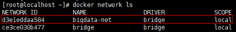
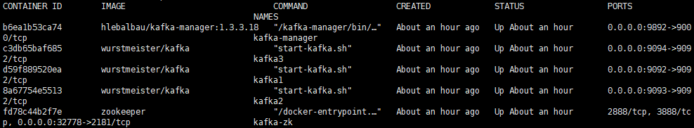
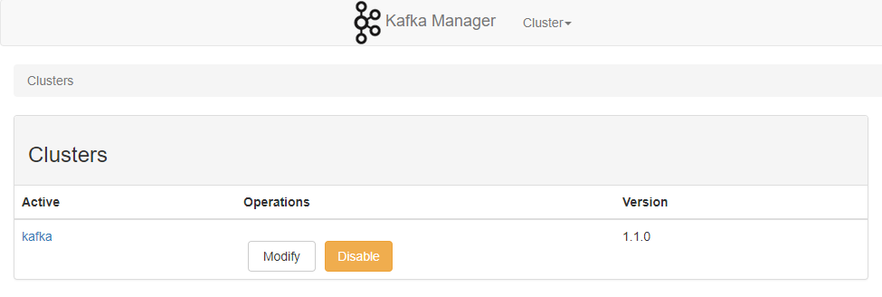

# Docker 安装 Kafka1.1.0 集群

## 软件安装

1.  Docker获取最新版Kafka及Kafka-manager<br>

    ```命令
    > docker pull wurstmeister/kafka
    > docker pull hlebalbau/kafka-manager:1.3.3.18
    ```

    > ![info][info] [kafka说明地址][wurstmeister/kafka地址]<br>
    > ![info][info] [kafka-manager说明地址][hlebalbau/kafka-manager地址]<br>

2.  创建Kafka宿主目录(DockerCompose脚本及配置)<br>

    ```命令
    > mkdir -p /home/docker/kafka/script /home/docker/kafka/manager/conf
    ```

3.  Docker创建归属Kafka使用的网络<br>

    ```命令
    > docker network create --driver=bridge bigdata-net
    ```

    <br>

4.  kafka-manager配置处理<br>
    a.获取kafka-manager的最新配置<br>

    > ![info][info] [kafka-manager项目地址][kafka-manager项目地址]<br>
    > 拷贝\[项目地址\]的conf文件夹下所有文件

    b.修改配置可使二级目录进行页面访问<br>

    >1.修改[application.conf](files/10/conf/application.conf)的play.http.context参数 -> play.http.context = "/kafka-manager/"<br>
    >2.修改[routes](files/10/conf/routes)的所有参数 -> 把所有的地址前都增加/kafka-manager<br>

5.  Docker运行Kafka集群<br>
    a. 拷贝运行脚本到特定目录<br>

    > [start-container.sh](files/10/start-container.sh) -> /home/docker/kafka/<br>
    > [script/dc-kafka.yml](files/10/script/dc-kafka.yml) -> /home/docker/kafka/script/<br>
    > [conf/application.conf](files/10/conf/application.conf) -> /home/docker/kafka/manager/conf<br>
    > [conf/consumer.properties](files/10/conf/consumer.properties) -> /home/docker/kafka/manager/conf<br>
    > [conf/logback.xml](files/10/conf/logback.xml) -> /home/docker/kafka/manager/conf<br>
    > [conf/logger.xml](files/10/conf/logger.xml) -> /home/docker/kafka/manager/conf<br>
    > [conf/routes](files/10/conf/routes) -> /home/docker/kafka/manager/conf<br>

    b. 设置执行权限<br>

    ```命令
    > chmod +x /home/docker/kafka/*.sh
    ```

    c. 运行Kafka集群<br>

    ```命令
    > cd /home/docker/kafka/
    > ./start-container.sh
    ```

6.  Nginx添加访问跳转<br>
    a. 添加Nginx配置<br>

    ```命令
    > sudo vim /home/docker/nginx/etc/conf.d/default.conf
    ```

    ```内容
    server {
        …
        location /kafka/ {
            proxy_pass http://localhost:9892/kafka-manager/;
            proxy_set_header Host $host;
            proxy_set_header X-Real-IP $remote_addr;
            proxy_set_header X-Forwarded-For $proxy_add_x_forwarded_for;
            proxy_set_header X-Forwarded-Proto $scheme;
            proxy_redirect off;
        }
    
        location /kafka-manager/ {
            proxy_pass http://localhost:9892/kafka-manager/;
            proxy_set_header Host $host;
            proxy_set_header X-Real-IP $remote_addr;
            proxy_set_header X-Forwarded-For $proxy_add_x_forwarded_for;
            proxy_set_header X-Forwarded-Proto $scheme;
            proxy_redirect off;
        }
        …
    }
    ```

    >![info][info] 上边的kafka是自定义的,底下的kafka-manager和[conf/routes](files/10/conf/routes)配置一样即可<br>

    b. 验证Nginx配置<br>

    ```命令
    > docker run -it \
                 --rm \
                 -v /home/docker/nginx/etc/nginx.conf:/etc/nginx/nginx.conf:ro \
                 -v /home/docker/nginx/etc/conf.d:/etc/nginx/conf.d \
                 nginx \
                 nginx -t -c /etc/nginx/nginx.conf
    ```

    c. Docker重启nginx<br>

    ```命令
    > docker restart nginx
    ```

    d. 验证rocketmq是否运行正常<br>

    <br>

    > [访问控制台页面:访问http\://\<宿主机ip>/kafka](http://ep.cn/kafka)<br>

    <br>

7. 打开防火墙端口<br>
    a. 查看当前活动防火墙策略<br>

    ```命令
    > sudo firewall-cmd --zone=public --list-all
    ```

    b. 为防火墙策略增加允许端口<br>

    ```命令
    > sudo firewall-cmd --zone=public --add-port=9092/tcp --add-port=9093/tcp --add-port=9094/tcp --permanent
    ```

    c. 重启防火墙<br>

    ```命令
    > sudo firewall-cmd --reload
    ```

    d. 查看是否添加成功<br>

    ```命令
    > sudo firewall-cmd --zone=public --list-all
    ```

[wurstmeister/kafka地址]: https://hub.docker.com/r/wurstmeister/kafka/
[hlebalbau/kafka-manager地址]: https://hub.docker.com/r/hlebalbau/kafka-manager/
[kafka-manager项目地址]: https://github.com/yahoo/kafka-manager
[info]: /images/info.png
