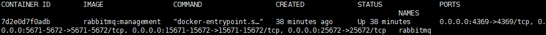
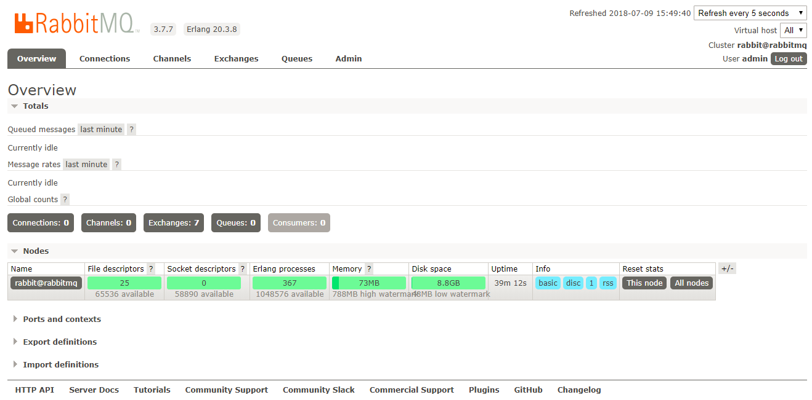

# Docker 安装 RabbitMQ3.7.7

## 软件安装

1.  Docker获取最新版RabbitMQ<br>

    ```命令
    > docker pull rabbitmq:management
    ```

    > ![info][info] [rabbitmq说明地址][rabbitmq地址]<br>
    > 如果docker pull rabbitmq 后面不带management，启动rabbitmq后是无法打开管理界面的，所以我们要下载带management插件的rabbitmq。

2.  Docker运行RabbitMQ<br>
    a. 拷贝运行脚本到特定目录<br>

    > [start-container.sh](files/11/start-container.sh) -> /home/docker/rabbitmq/<br>

    b. 设置执行权限<br>

    ```命令
    > chmod +x /home/docker/rabbitmq/*.sh
    ```

    c. 运行RabbitMQ<br>

    ```命令
    > cd /home/docker/rabbitmq/
    > ./start-container.sh
    ```

3.  Nginx添加访问跳转<br>
    a. 添加Nginx配置<br>

    ```命令
    > sudo vim /home/docker/nginx/etc/conf.d/default.conf
    ```

    ```内容
    server {
       …
       location /rabbitmq/ {
            proxy_pass http://localhost:15672/;
            proxy_set_header Host $host:80;
            proxy_set_header X-Real-IP $remote_addr;
            proxy_set_header X-Forwarded-For $proxy_add_x_forwarded_for;
            proxy_set_header X-Forwarded-Proto $scheme;
        }
        …
    }
    ```

    b. 验证Nginx配置<br>

    ```命令
    > docker run -it \
                 --rm \
                 -v /home/docker/nginx/etc/nginx.conf:/etc/nginx/nginx.conf:ro \
                 -v /home/docker/nginx/etc/conf.d:/etc/nginx/conf.d \
                 nginx \
                 nginx -t -c /etc/nginx/nginx.conf
    ```

    c. Docker重启nginx<br>

    ```命令
    > docker restart nginx
    ```

    d. 验证RabbitMQ是否运行正常<br>

    <br>

    > [访问控制台页面:访问http\://\<宿主机ip>/rabbitmq](http://ep.cn/rabbitmq)<br>

    <br>

    > 输入用户名admin,密码1qaz2wsx

    <br>

4. 打开防火墙端口<br>
    a. 查看当前活动防火墙策略<br>

    ```命令
    > sudo firewall-cmd --zone=public --list-all
    ```

    b. 为防火墙策略增加允许端口<br>

    ```命令
    > sudo firewall-cmd --zone=public --add-port=5671/tcp --add-port=5672/tcp --add-port=4369/tcp --add-port=25672/tcp --add-port=15671/tcp --permanent
    ```

    c. 重启防火墙<br>

    ```命令
    > sudo firewall-cmd --reload
    ```

    d. 查看是否添加成功<br>

    ```命令
    > sudo firewall-cmd --zone=public --list-all
    ```

[rabbitmq地址]: https://hub.docker.com/r/library/rabbitmq/
[info]: /images/info.png
