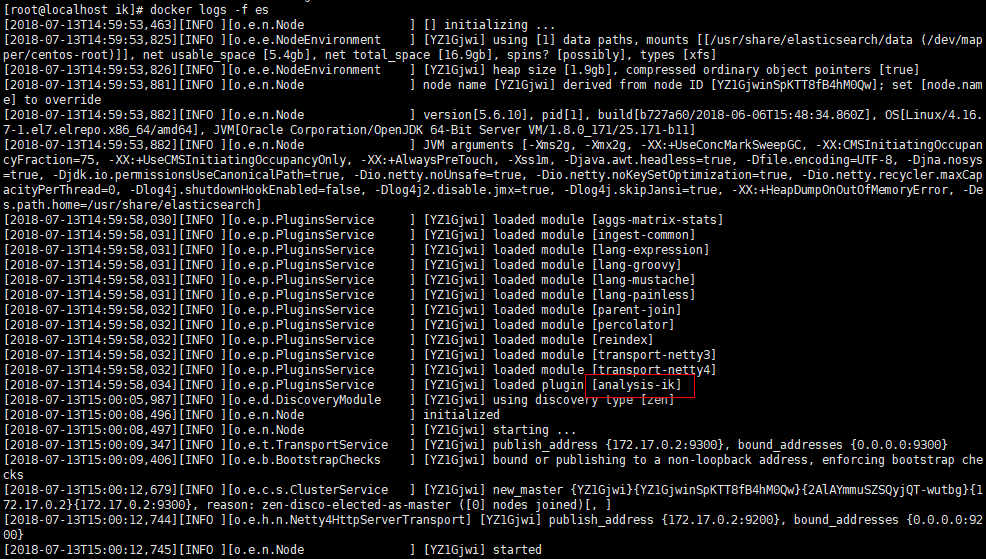

# Docker 安装 Elasticsearch5.6.10

## 软件安装

1.  Docker获取最新版Elasticsearch<br>

    ```命令
    > docker pull elasticsearch
    ```

    > ![info][info] [elasticsearch说明地址][elasticsearch地址]<br>
    > Elasticsearch从6.x.x开始迁移到[www.docker.elastic.co](https://www.docker.elastic.co/)<br>

2.  Docker运行Elasticsearch<br>
    a. 拷贝运行脚本到特定目录<br>

    > [start-container.sh](files/12/start-container.sh) -> /home/docker/es/<br>

    b. 设置执行权限<br>

    ```命令
    > chmod +x /home/docker/es/*.sh
    ```

    c. 运行Elasticsearch<br>

    ```命令
    > cd /home/docker/es/
    > ./start-container.sh
    ```

3. 打开防火墙端口<br>
    a. 查看当前活动防火墙策略<br>

    ```命令
    > sudo firewall-cmd --zone=public --list-all
    ```

    b. 为防火墙策略增加允许端口<br>

    ```命令
    > sudo firewall-cmd --zone=public --add-port=9200/tcp --add-port=9300/tcp --permanent
    ```

    c. 重启防火墙<br>

    ```命令
    > sudo firewall-cmd --reload
    ```

    d. 查看是否添加成功<br>

    ```命令
    > sudo firewall-cmd --zone=public --list-all
    ```

4. Elasticsearch安装插件<br>
    a. 下载插件elasticsearch-analysis-ik(5.6.9)

    > [项目地址](https://github.com/medcl/elasticsearch-analysis-ik)<br>
    > [下载地址](https://github.com/medcl/elasticsearch-analysis-ik/releases)<br>
    > 下载时，需要关注elasticsearch版本，选择插件和es版本最为接近的版本，如es为5.6.10，那么插件尽量选择5.6.x，否则可能出现未知问题<br>

    b. 创建插件目录

    ```命令
    > mkdir -p /home/docker/es/plugins/ik
    ```

    c. 插件zip包放到指定目录并解压缩

    ```命令
    > cd /home/docker/es/plugins/ik/
    > unzip elasticsearch-analysis-ik-5.6.9.zip
    > mv elasticsearch/* ./
    > rm -rf elasticsearch
    > rm -rf elasticsearch-analysis-ik-5.6.9.zip
    ```

    d. 修改插件依赖elasticsearch版本号

    ```命令
    > cd /home/docker/es/plugins/ik/
    > vim plugin-descriptor.properties
    ```

    ```内容
    elasticsearch.version=5.6.10
    ```

    e. 重新启动elasticsearch

    ```命令
    > docker restart es
    ```

    <br>

[elasticsearch地址]: https://hub.docker.com/_/elasticsearch/
[info]: /images/info.png
