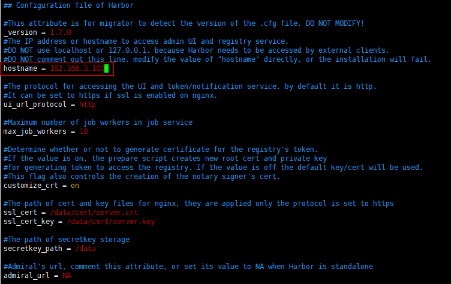

# Docker 安装 Harbor1.7.5

## 软件安装

1.  Docker获取最新版Harbor<br>

    > ![info][info] [Harbor最新版地址][Harbor地址]

2.  创建Harbor宿主目录<br>

    ```命令
    > mkdir -p /home/docker/harbor
    ```

3.  安装Harbor<br>
    a. 下载Harbor<br>

    <br>
    
    ```命令
    > cd /home/docker/harbor
    > wget https://storage.googleapis.com/harbor-releases/release-1.7.0/harbor-online-installer-v1.7.5.tgz --no-check-certificate
    ```

    b. 解压缩<br>
    
    ```命令
    > tar -xzvf harbor-online-installer-v1.7.5.tgz
    ```

    c. 修改配置文件<br>

    ```命令
    > vim /home/docker/harbor/harbor/harbor.cfg 
    ```

    <br>

    d. 修改docker-compose的容器名称(防止重复都增加harbor-)<br>

    ```命令
    > vim /home/docker/harbor/harbor/docker-compose.yml
    ```

    <br>

    e. 执行安装脚本<br>

    ```命令
    > cd /home/docker/harbor/harbor
    > sudo ./install.sh
    ```

4.  验证启动结果<br>
    
    > ![info][info] [http\://\<宿主机ip>/harbor](http://192.168.3.100/harbor/)<br>
    > 用户名密码：admin/Harbor12345

    <br>
    <br>   

[Harbor地址]: https://github.com/goharbor/harbor/releases

[info]: /images/info.png
