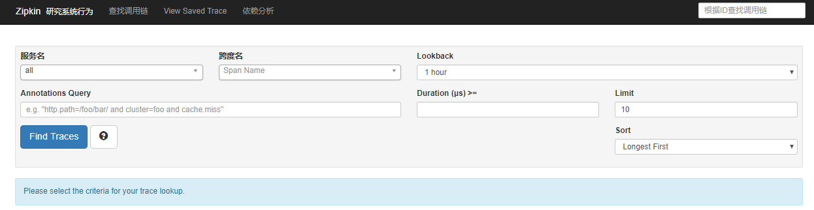

# Docker 安装 ZipkinServer2.11.1

## 软件安装

1.  Docker获取最新版ZipkinServer<br>

    ```命令
    > docker pull openzipkin/zipkin
    ```

    > ![info][info] [openzipkin/zipkin说明地址][openzipkin/zipkin地址]

2.  Docker运行ZipkinServer<br>
    a. 拷贝运行脚本到特定目录<br>

    > [start-container.sh](files/15/start-container.sh) -> /home/docker/zipkin/<br>

    b. 设置执行权限<br>

    ```命令
    > chmod +x /home/docker/zipkin/*.sh
    ```

    c. 运行ZipkinServer<br>

    ```命令
    > cd /home/docker/zipkin/
    > ./start-container.sh
    ```

    d. 验证是否启动成功<br>

    > [访问Manager页面:\[Your IP Address\]:9411/](http://ep.cn:9411)<br>

    <br>
    <br>
    <br>

3.  打开防火墙端口<br>
    a. 查看当前活动防火墙策略<br>

    ```命令
    > sudo firewall-cmd --zone=public --list-all
    ```

    b. 为防火墙策略增加允许服务<br>

    ```命令
    > sudo firewall-cmd --zone=public --add-port=9411/tcp --permanent
    ```

    c. 重启防火墙<br>

    ```命令
    > sudo firewall-cmd --reload
    ```

    d. 查看是否添加成功<br>

    ```命令
    > sudo firewall-cmd --zone=public --list-all
    ```

[info]: /images/info.png

[openzipkin/zipkin地址]: https://hub.docker.com/r/openzipkin/zipkin/
