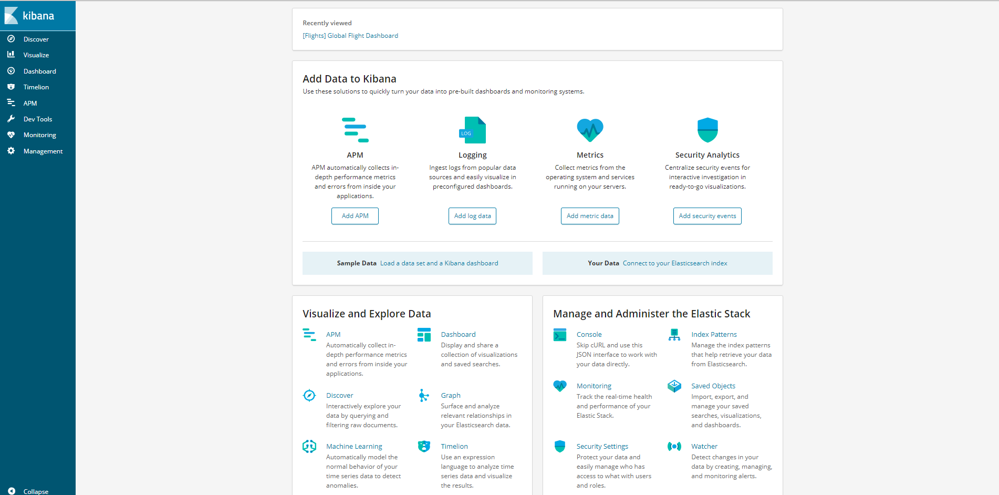
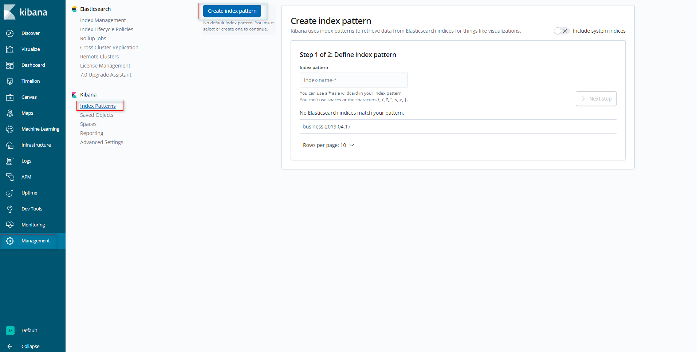
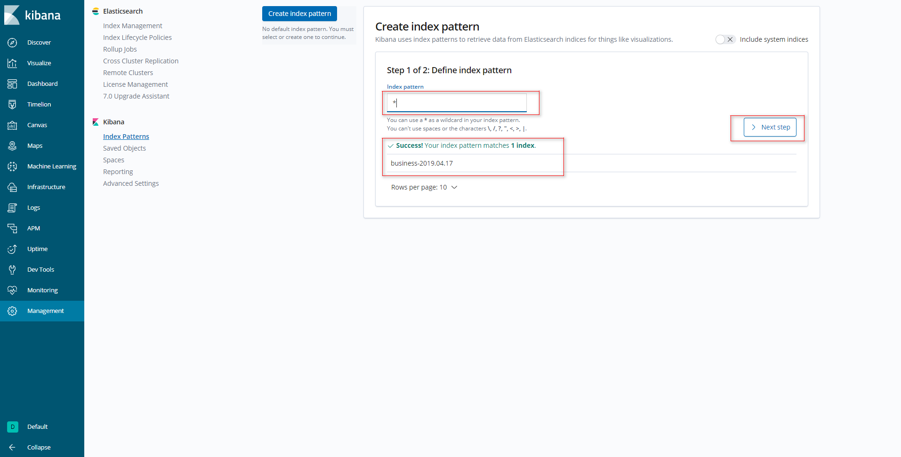
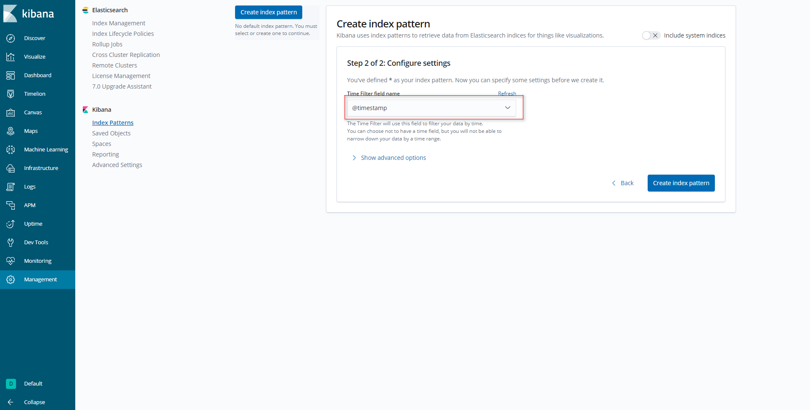
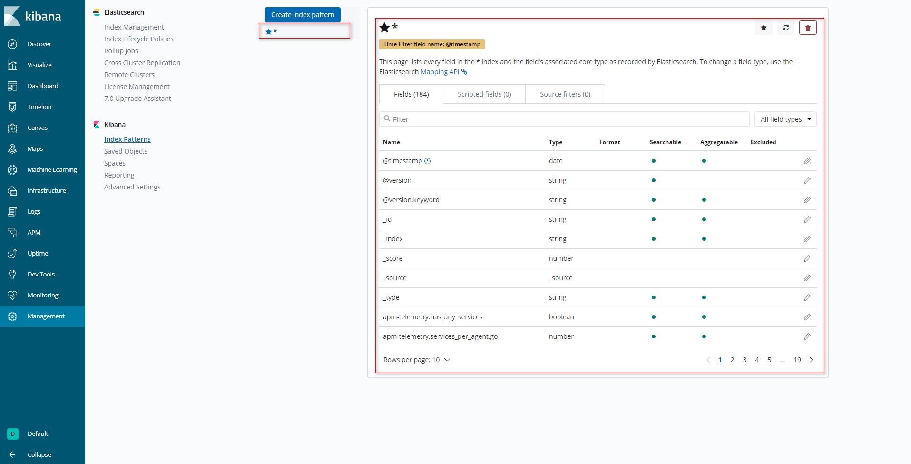
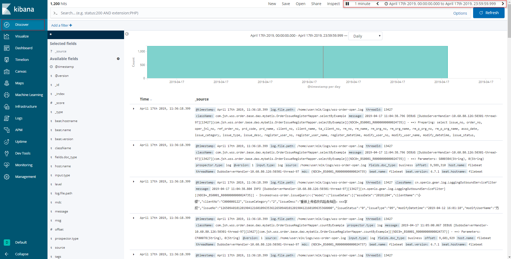
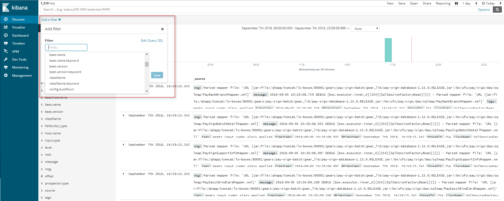
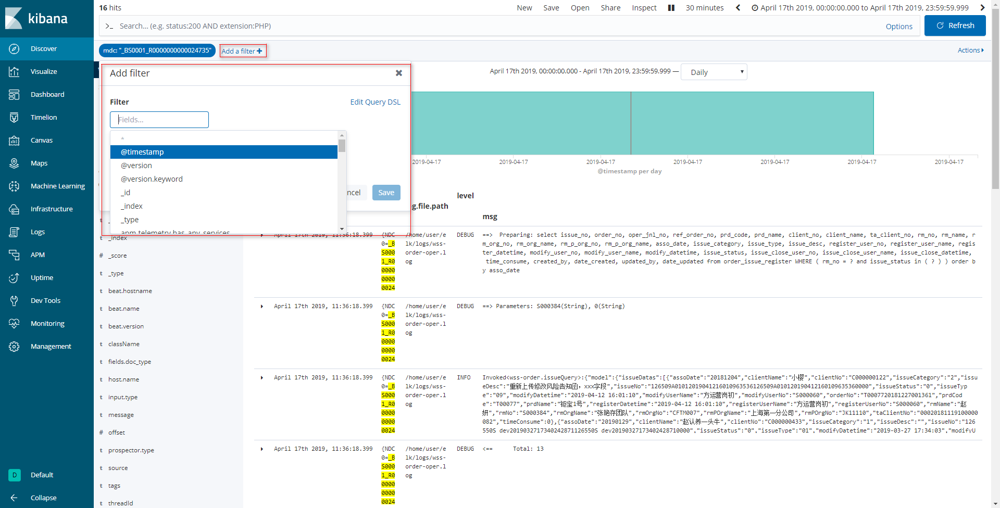

# Docker 安装 ELK6.7.0

## 软件安装

1.  Docker获取最新版ELK<br>

    ```命令
    > docker pull elasticsearch:6.7.0
    > docker pull kibana:6.7.0
    > docker pull logstash:6.7.0
    > docker pull elastic/filebeat:6.7.0
    ```

    > ![info][info] [elasticsearch说明地址][elasticsearch地址]<br>
    > ![info][info] [kibana说明地址][kibana地址]<br>
    > ![info][info] [logstash说明地址][logstash地址]<br>
    > ![info][info] [filebeat说明地址][filebeat地址]<br>

2.  创建ELK宿主目录(脚本及配置,待处理的日志目录)<br>

    ```命令
    > mkdir -p /home/docker/elk/logs
    > mkdir -p /home/docker/elk/script
    > mkdir -p /home/docker/elk/filebeat/conf
    > mkdir -p /home/docker/elk/logstash/conf
    ```

3.  Docker创建归属elk使用的网络<br>

    ```命令
    > docker network create -d bridge elk-net
    ```

4.  Docker运行ELK<br>
    a. 拷贝运行脚本到特定目录<br>

    > [start-container.sh](files/16/start-container.sh) -> /home/docker/elk/<br>
    > [filebeat/conf/filebeat.yml](files/16/filebeat/conf/filebeat.yml) -> /home/docker/elk/filebeat/conf/<br>
    > [logstash/conf/logstash.conf](files/16/logstash/conf/logstash.conf) -> /home/docker/elk/logstash/conf/<br>
    > [script/dc-elk.yml](files/16/script/dc-elk.yml) -> /home/docker/elk/script/<br>

    b. 设置执行权限<br>

    ```命令
    > chmod +x /home/docker/elk/*.sh
    ```

    c. 运行ELK<br>

    ```命令
    > cd /home/docker/elk/
    > ./start-container.sh
    ```

    d. 验证是否启动成功<br>

    > [访问Manager页面:\[Your IP Address\]:5601/](http://ep.cn:5601)<br>

    <br>

5. 打开防火墙端口<br>
    a. 查看当前活动防火墙策略<br>

    ```命令
    > sudo firewall-cmd --zone=public --list-all
    ```

    b. 为防火墙策略增加允许端口<br>

    ```命令
    > sudo firewall-cmd --zone=public --add-port=9200/tcp --add-port=9300/tcp --permanent
    ```

    c. 重启防火墙<br>

    ```命令
    > sudo firewall-cmd --reload
    ```

    d. 查看是否添加成功<br>

    ```命令
    > sudo firewall-cmd --zone=public --list-all
    ```

6. 设置Kibana搜索规则<br>
    a. 添加Kibana的index设置<br>

    <br>
    <br>
    <br>
    <br>

    b. Discover增加Filter查看搜索结果<br>

    <br>
    <br>
    <br>

[elasticsearch地址]: https://hub.docker.com/_/elasticsearch
[kibana地址]: https://hub.docker.com/_/kibana
[logstash地址]: https://hub.docker.com/_/logstash
[filebeat地址]: https://hub.docker.com/_/filebeat
[info]: /images/info.png
