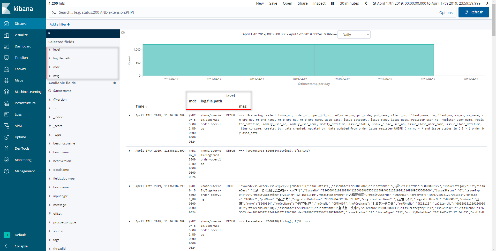
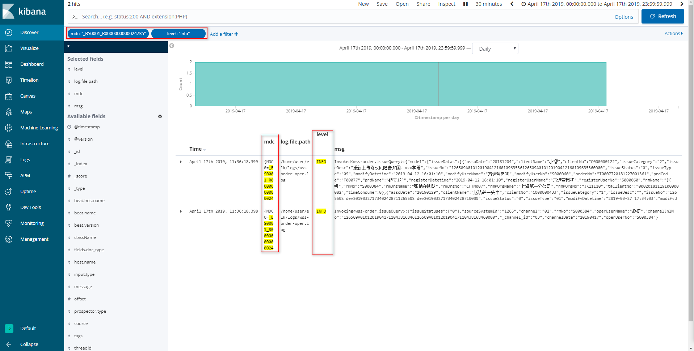

# Docker 安装 ELK6.7.1

## 软件安装

1.  Docker获取最新版ELK<br>

    ```命令
    > docker pull elasticsearch:6.7.1
    > docker pull kibana:6.7.1
    > docker pull logstash:6.7.1
    > docker pull elastic/filebeat:6.7.1
    ```

    > ![info][info] [elasticsearch说明地址][elasticsearch地址]<br>
    > ![info][info] [kibana说明地址][kibana地址]<br>
    > ![info][info] [logstash说明地址][logstash地址]<br>
    > ![info][info] [filebeat说明地址][filebeat地址]<br>

2.  创建ELK宿主目录(脚本及配置,待处理的日志目录)<br>

    ```命令
    > mkdir -p /home/docker/elk/logs
    > mkdir -p /home/docker/elk/script
    > mkdir -p /home/docker/elk/filebeat/conf
    > mkdir -p /home/docker/elk/logstash/conf
    ```

3.  Docker创建归属elk使用的网络<br>

    ```命令
    > docker network create -d bridge elk-net
    ```

4.  Docker运行ELK<br>
    a. 拷贝运行脚本到特定目录<br>

    > [start-container.sh](files/16/start-container.sh) -> /home/docker/elk/<br>
    > [filebeat/conf/filebeat.yml](files/16/filebeat/conf/filebeat.yml) -> /home/docker/elk/filebeat/conf/<br>
    > [logstash/conf/logstash.conf](files/16/logstash/conf/logstash.conf) -> /home/docker/elk/logstash/conf/<br>
    > [script/dc-elk.yml](files/16/script/dc-elk.yml) -> /home/docker/elk/script/<br>

    b. 设置执行权限<br>

    ```命令
    > chmod +x /home/docker/elk/*.sh
    ```

    c. 运行ELK<br>

    ```命令
    > cd /home/docker/elk/
    > ./start-container.sh
    ```

5.  Nginx添加访问跳转<br>
    a. 获取Kibana容器IP<br>

    ```命令
    > docker inspect --format='{{range .NetworkSettings.Networks}}{{.IPAddress}}{{end}}' kibana
    ```

    <br>

    b. 添加Nginx配置<br>

    ```命令
    > sudo vim /home/docker/nginx/etc/conf.d/default.conf
    ```

    ```内容
    server {
       …
       location /kibana/ {
            proxy_pass http://172.20.0.3:5601/;
            proxy_set_header Host $host:80;
            proxy_set_header X-Real-IP $remote_addr;
            proxy_set_header X-Forwarded-For $proxy_add_x_forwarded_for;
            proxy_set_header X-Forwarded-Proto $scheme;
        }
        …
    }
    ```

    c. 验证Nginx配置<br>

    ```命令
    > docker run -it \
                 --rm \
                 -v /home/docker/nginx/etc/nginx.conf:/etc/nginx/nginx.conf:ro \
                 -v /home/docker/nginx/etc/conf.d:/etc/nginx/conf.d \
                 nginx \
                 nginx -t -c /etc/nginx/nginx.conf
    ```

    d. Docker重启nginx<br>

    ```命令
    > docker restart nginx
    ```

    e. 验证jenkins是否运行正常<br>
    
    > ![info][info] 访问http\://\<宿主机ip>/kibana

    
6. 设置Kibana搜索规则<br>
    a. 添加Kibana的index设置<br>

    <br>
    <br>
    <br>
    <br>

    b. Discover增加Filter查看搜索结果<br>

    <br>
    <br>
    <br>
    <br>

[elasticsearch地址]: https://hub.docker.com/_/elasticsearch
[kibana地址]: https://hub.docker.com/_/kibana
[logstash地址]: https://hub.docker.com/_/logstash
[filebeat地址]: https://hub.docker.com/_/filebeat
[info]: /images/info.png
