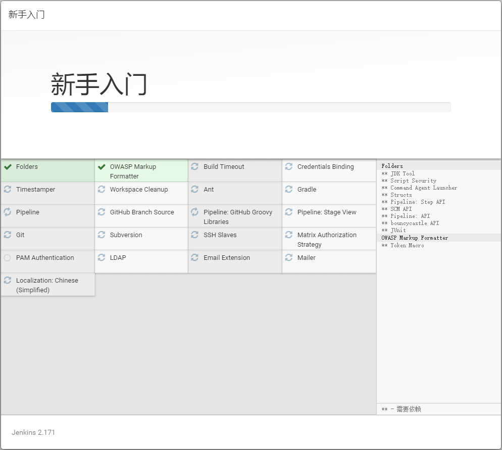

# Docker 安装 Jenkins2.171

## 软件安装

1.  Docker获取最新版Jenkins<br>

    ```命令
    > docker pull jenkins/jenkins
    ```

    > ![info][info] [Jenkins说明地址][Jenkins地址]<br>
    > ![info][info] [Jenkins中文文档地址](https://jenkins.io/zh/doc/book/installing)<br>
    
2.  创建Jenkins宿主目录<br>

    ```命令
    > mkdir -p /home/docker/jenkins/data
    ```

3.  Docker运行Jenkins<br>
    a. 拷贝运行脚本到特定目录<br>

    > [start-container.sh](files/17/start-container.sh) -> /home/docker/jenkins/<br>

    b. 设置执行权限<br>

    ```命令
    > chmod +x /home/docker/jenkins/*.sh
    ```

    c. 运行Jenkins<br>

    ```命令
    > cd /home/docker/jenkins/
    > ./start-container.sh
    ```

4.  配置Jenkins<br>
    
    > 查看jenkins启动日志，获取默认密码

    ```命令
    > docker logs -f jenkins
    ```

    <br>

    > [访问控制台页面:访问http\://\<宿主机ip>:38080](http://192.168.3.100:38080/)<br>
    > 输入密码0f71278bb1ea4fec88755cd1fd7432d9<br>

    <br>

    > 选择插件安装方式

    <br>

    > 选择安装推荐插件

    <br>    

    > 设置管理员 -> 设置root密码1qaz2wsx

    <br>    

5.  Nginx添加访问跳转<br>
    a. 添加Nginx配置<br>

    ```命令
    > sudo vim /home/docker/nginx/etc/conf.d/default.conf
    ```

    ```内容
    server {
       …
       location /jenkins/ {
            proxy_pass http://localhost:38080/jenkins/;
            proxy_set_header Host $host:80;
            proxy_set_header X-Real-IP $remote_addr;
            proxy_set_header X-Forwarded-For $proxy_add_x_forwarded_for;
            proxy_set_header X-Forwarded-Proto $scheme;
        }
        …
    }
    ```

    b. 验证Nginx配置<br>

    ```命令
    > docker run -it \
                 --rm \
                 -v /home/docker/nginx/etc/nginx.conf:/etc/nginx/nginx.conf:ro \
                 -v /home/docker/nginx/etc/conf.d:/etc/nginx/conf.d \
                 nginx \
                 nginx -t -c /etc/nginx/nginx.conf
    ```

    c. Docker重启nginx<br>

    ```命令
    > docker restart nginx
    ```

    d. 验证jenkins是否运行正常<br>

[info]: /images/info.png

[Jenkins地址]: https://hub.docker.com/r/jenkins/jenkins/
