# VMware Workstation Pro 14 安装 CentOS7

## 配置虚拟机

1.  打开虚拟机 
     
2.  创建新的虚拟机 -> 典型(推荐) -> 下一步 
    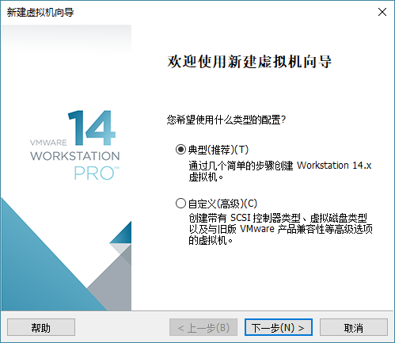 
3.  安装客户机操作系统 -> 稍后安装操作系统 -> 下一步 
    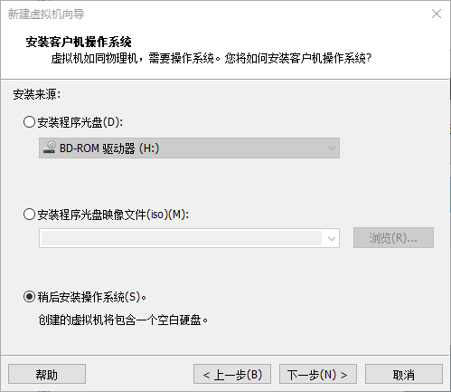 
4.  选择客户机操作系统 -> 客户机操作系统：Linux -> 版本：CentOS 7 64 位 -> 下一步 
    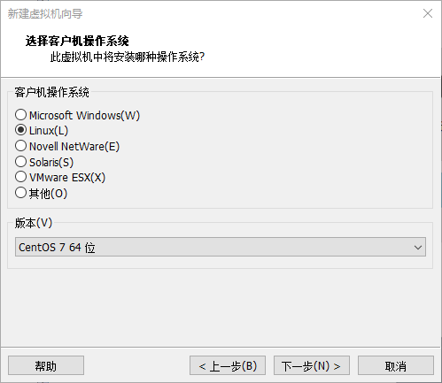 
5.  命名虚拟机 -> 虚拟机名称：CentOS7 -> 位置：C:\\VMware\\CentOS7 -> 下一步 
    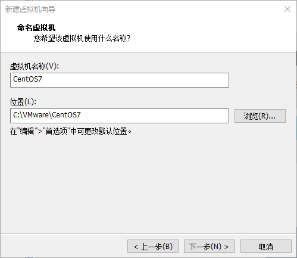 
6.  指定磁盘容量 -> 最大磁盘大小：20G -> 将虚拟磁盘拆分成多个文件 -> 下一步 
    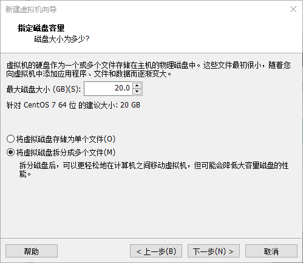 
7.  已准备好创建虚拟机 -> 自定义硬件 
    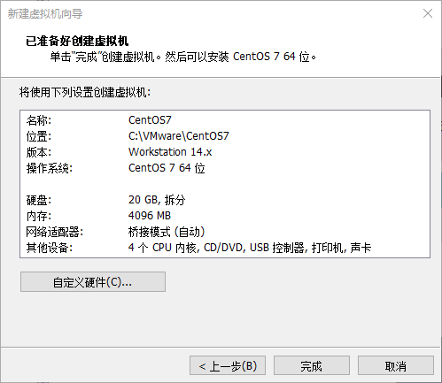 
8.  内存：4096MB -> 处理器：处理器数量：1;每个处理器内核数量：4 -> 网络适配器：桥接模式 -> 新 CD/DVD：使用 ISO 镜像文件 -> 关闭 
    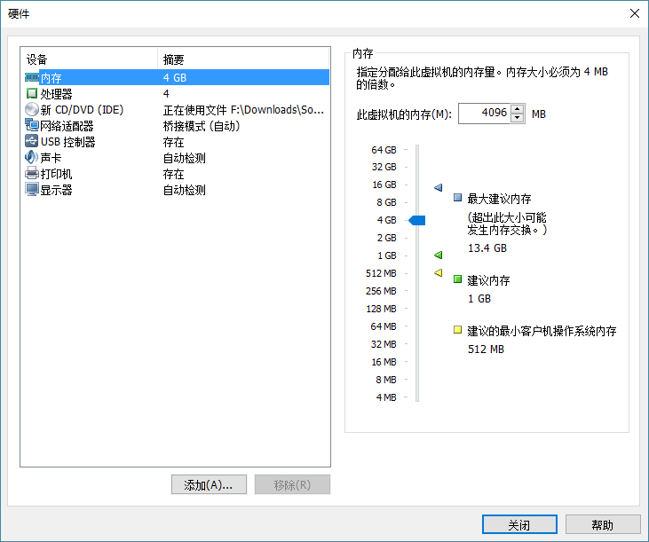 
    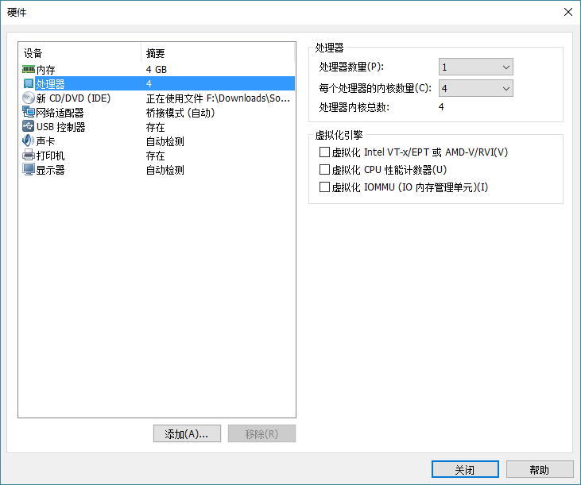 
    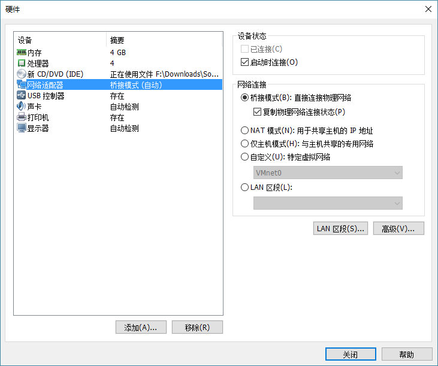 
    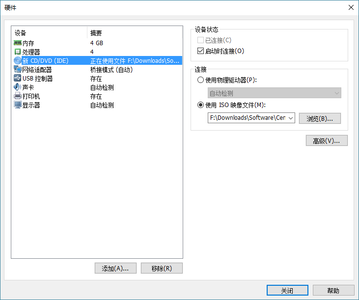 
9.  完成 -> 开启此虚拟机 
    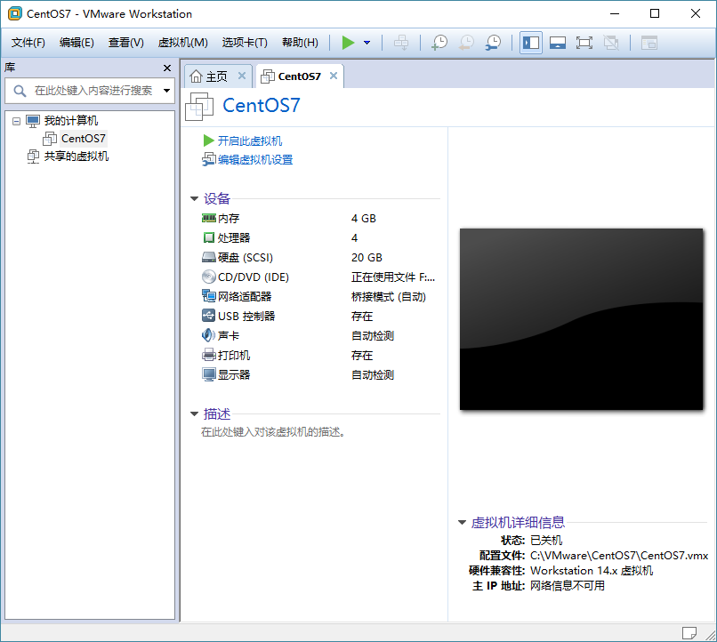 
