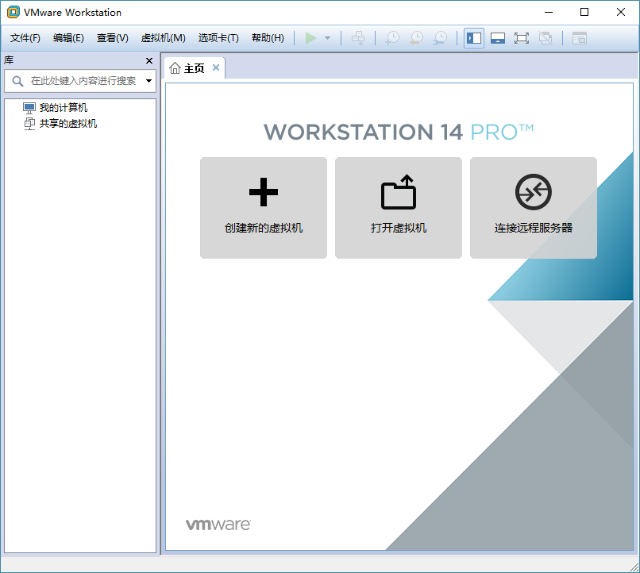
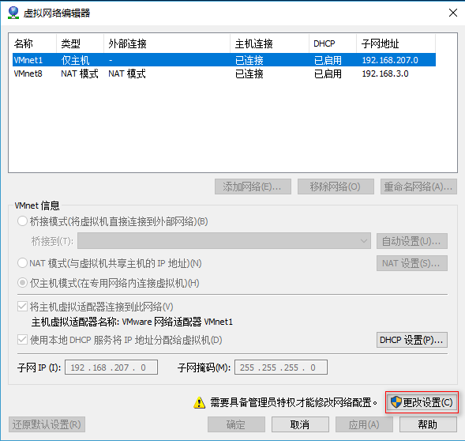
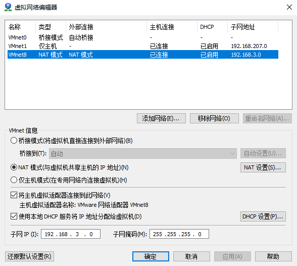
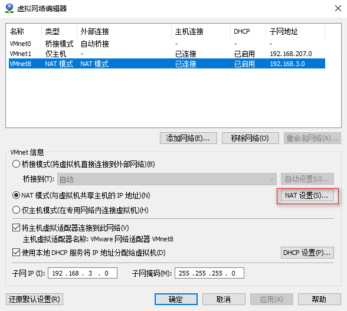
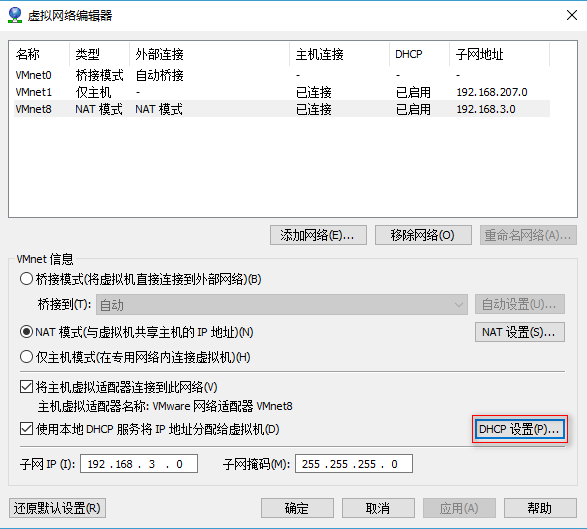
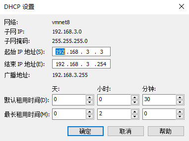

# VMware Workstation Pro 14 修改子网地址

## 配置虚拟机

1.  打开虚拟机 
     
2.  选择编辑->虚拟网络编辑器->选择“更改设置” 
     
     
3.  选择NAT模式 
4.  修改子网IP 
5.  点击“NAP设置”->查看网关IP 
     
     
6.  点击“DHCP设置”->修改起始IP地址及结束IP地址 
     
     
7.  打开虚拟机验证当前网络IP 
